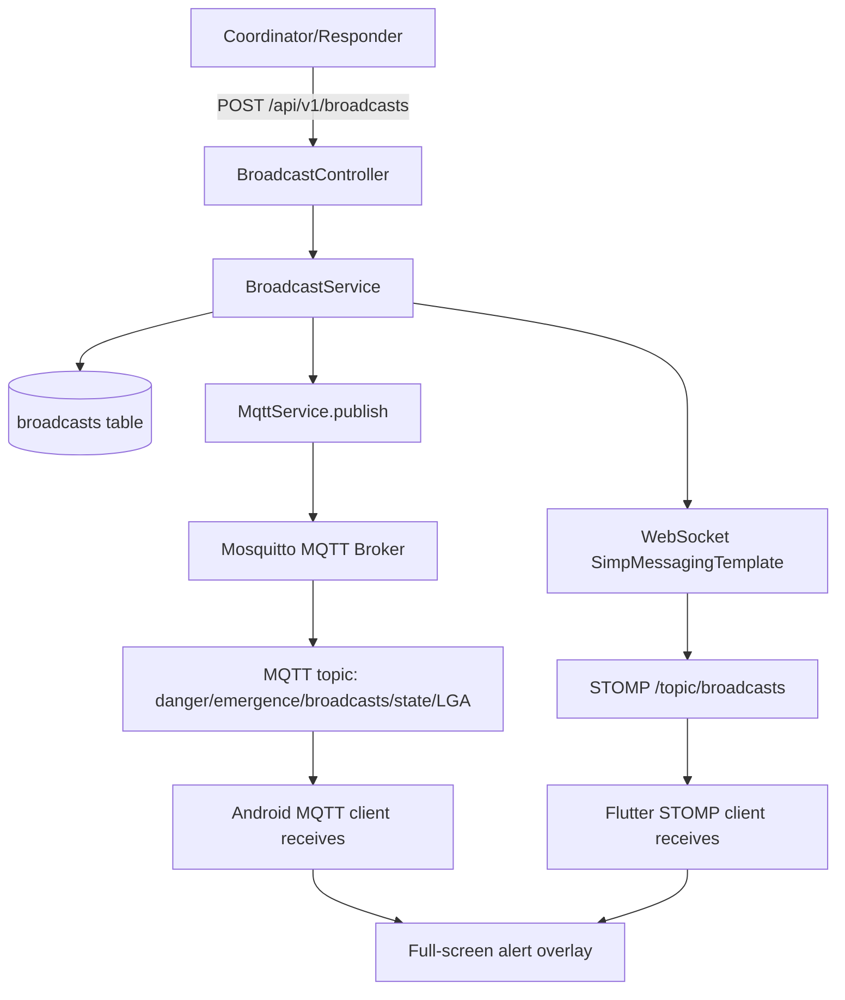
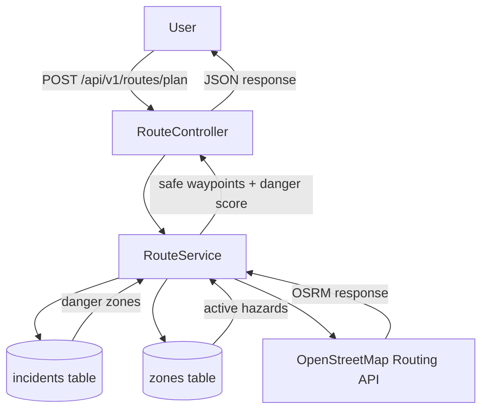
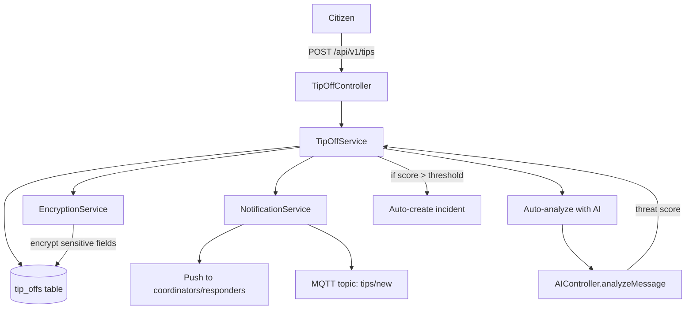
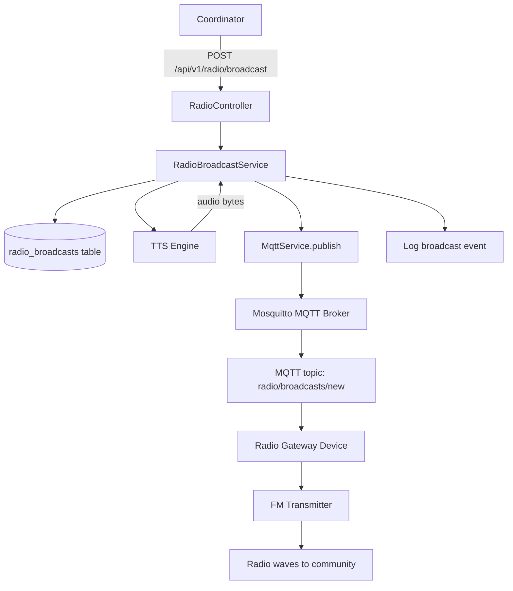

# Architecture Design: 4 New Features for Danger Emergence

## Overview

This document describes the architecture for 4 new features to fight terrorism, kidnapping, and banditry in Nigeria. All heavy logic runs on the backend; the frontend is a thin client that only calls APIs and displays results.

---

## Feature 1: Mass Alert / Broadcast System

### Purpose
Send emergency alerts to ALL users in a geographic area (e.g., "Kidnappers spotted in XYZ village"). Terrorists move fast — entire communities need instant warnings.

### Architecture



### Backend Components

#### 1. Database Migration: `V5__add_broadcasts.sql`
```sql
CREATE TABLE IF NOT EXISTS broadcasts (
    id VARCHAR(36) PRIMARY KEY,
    title VARCHAR(255) NOT NULL,
    message TEXT NOT NULL,
    severity VARCHAR(20) NOT NULL DEFAULT 'urgent',  -- info, warning, urgent, critical
    broadcast_type VARCHAR(50) NOT NULL DEFAULT 'general',  -- general, evacuation, curfew, manhunt, school_closure
    target_state VARCHAR(50),        -- NULL = all states
    target_lga VARCHAR(50),          -- NULL = all LGAs in state
    target_roles VARCHAR(255),       -- comma-separated: citizen,responder,guardian,coordinator
    latitude DOUBLE PRECISION,       -- optional geo-target center
    longitude DOUBLE PRECISION,
    radius_km DOUBLE PRECISION,      -- optional geo-target radius
    created_by VARCHAR(36) REFERENCES users(id),
    is_active BOOLEAN DEFAULT true,
    expires_at TIMESTAMP,
    created_at TIMESTAMP DEFAULT CURRENT_TIMESTAMP,
    updated_at TIMESTAMP DEFAULT CURRENT_TIMESTAMP
);

CREATE INDEX IF NOT EXISTS idx_broadcasts_active ON broadcasts(is_active);
CREATE INDEX IF NOT EXISTS idx_broadcasts_severity ON broadcasts(severity);
CREATE INDEX IF NOT EXISTS idx_broadcasts_target ON broadcasts(target_state, target_lga);
CREATE INDEX IF NOT EXISTS idx_broadcasts_created ON broadcasts(created_at DESC);
```

#### 2. Model: `Broadcast.java`
- Fields: id, title, message, severity (enum), broadcastType (enum), targetState, targetLga, targetRoles, latitude, longitude, radiusKm, createdBy (User ref), isActive, expiresAt, createdAt, updatedAt
- Enums: BroadcastSeverity {info, warning, urgent, critical}, BroadcastType {general, evacuation, curfew, manhunt, school_closure, weather, security}

#### 3. Repository: `BroadcastRepository.java`
- `findByIsActiveTrueOrderByCreatedAtDesc()`
- `findActiveBroadcastsForLocation(String state, String lga, LocalDateTime now)`
- `findActiveBroadcastsBySeverity(BroadcastSeverity severity)`

#### 4. Service: `BroadcastService.java`
- `createBroadcast(...)` — saves to DB, publishes via MQTT + WebSocket
- `getActiveBroadcasts(state, lga)` — returns active broadcasts filtered by location
- `expireBroadcast(String id)` — marks as inactive
- `publishToMqtt(Broadcast)` — publishes to `broadcasts/state/LGA` topic
- `publishToWebSocket(Broadcast)` — sends via SimpMessagingTemplate to `/topic/broadcasts`
- `publishToSmsGateway(Broadcast)` — (future) sends SMS via Twilio/AfricasTalking

#### 5. Controller: `BroadcastController.java`
- `POST /api/v1/broadcasts` — create broadcast (coordinator/responder only)
- `GET /api/v1/broadcasts/active` — get active broadcasts (optionally filter by state/lga)
- `GET /api/v1/broadcasts/{id}` — get broadcast details
- `POST /api/v1/broadcasts/{id}/expire` — expire a broadcast

#### 6. Security: Update `SecurityConfig.java`
- Add `.requestMatchers("/api/v1/broadcasts/**").authenticated()`

### Frontend Components (Thin Client)

#### 1. BackendApi methods (in `backend_api.dart`)
- `getActiveBroadcasts({String? state, String? lga})` → GET `/broadcasts/active`
- `createBroadcast(Map<String, dynamic> data)` → POST `/broadcasts`

#### 2. New Screen: `broadcast_screen.dart`
- List of active broadcasts with severity color coding
- Tap to expand and read full message
- Coordinator/responder: "Create Broadcast" button with form (title, message, severity, target area)

#### 3. New Screen: `create_broadcast_screen.dart` (coordinator/responder only)
- Form: title, message, severity selector, target state/LGA dropdown, optional geo-target

#### 4. Dashboard Update
- Add "Mass Alerts" quick action card (red, icon: Icons.campaign)
- Replace "No recent alerts" placeholder with live broadcast feed

#### 5. WebSocket Listener (in main.dart or a dedicated service)
- Connect to STOMP `/topic/broadcasts`
- On new broadcast: show full-screen dialog with severity-colored banner

---

## Feature 2: Safe Route Planning

### Purpose
Suggest safe routes to/from schools avoiding recent incident locations. Parents and teachers need to know which roads are safe.

### Architecture



### Backend Components

#### 1. Service: `RouteService.java`
- `planSafeRoute(double fromLat, double fromLng, double toLat, double toLng)`:
  1. Query incidents table for recent verified incidents along the corridor
  2. Query zones table for active danger/hazard zones
  3. Calculate danger score for each road segment
  4. Call OSRM (Open Source Routing Machine) or GraphHopper for base route
  5. Re-route around high-danger segments
  6. Return: waypoints list, total distance, estimated time, danger score per segment, alternative routes

- `getSchoolRoutes(String schoolId)` — predefined safe routes for registered schools
- `getDangerScore(double lat, double lng, double radiusKm)` — returns danger level for a location

#### 2. Controller: `RouteController.java`
- `POST /api/v1/routes/plan` — plan safe route between two points
  - Body: {fromLat, fromLng, toLat, toLng, avoidHighways, preferLitRoads}
  - Response: {routes: [{waypoints, distance, duration, dangerScore, segments: [{start, end, dangerLevel}]}]}
- `GET /api/v1/routes/danger-score` — get danger score for a location
  - Params: latitude, longitude, radiusKm
  - Response: {score: 0-100, level: safe/caution/dangerous/critical, nearbyIncidents: N}

#### 3. Danger Scoring Algorithm (in RouteService)
```
dangerScore = 0
for each incident within 5km of route segment:
    weight = severityWeight(incident.severity) * recencyWeight(incident.occurredAt)
    distanceFactor = 1 - (distance / 5km)
    dangerScore += weight * distanceFactor

segment.dangerLevel = 
    dangerScore == 0 → "safe"
    dangerScore < 5  → "caution"
    dangerScore < 15 → "dangerous"
    else             → "critical"
```

### Frontend Components (Thin Client)

#### 1. BackendApi methods
- `planSafeRoute(Map<String, dynamic> data)` → POST `/routes/plan`
- `getDangerScore(double lat, double lng, double radiusKm)` → GET `/routes/danger-score`

#### 2. New Screen: `safe_route_screen.dart`
- Two text fields: "From" and "To" (with current location button)
- "Plan Safe Route" button
- Results: Map with route polyline colored by segment danger level (green→yellow→orange→red)
- Route info card: distance, estimated time, overall danger score, alternative routes

#### 3. Map Integration
- Add "Safe Route" button to map_screen.dart control buttons
- When route is planned, overlay colored polyline on the map

#### 4. Dashboard Update
- Add "Safe Route" quick action card (green, icon: Icons.route)

---

## Feature 3: Tip-off / Intelligence Channel

### Purpose
Anonymous tip line for reporting planned attacks. Citizens can report suspicious activity without revealing identity.

### Architecture



### Backend Components

#### 1. Database Migration: `V6__add_tip_offs.sql`
```sql
CREATE TABLE IF NOT EXISTS tip_offs (
    id VARCHAR(36) PRIMARY KEY,
    tip_type VARCHAR(50) NOT NULL,  -- planned_attack, suspicious_person, suspicious_vehicle, 
                                     -- hidden_weapons, kidnapping_plot, bombing_plot, other
    description TEXT NOT NULL,
    latitude DOUBLE PRECISION,
    longitude DOUBLE PRECISION,
    accuracy DOUBLE PRECISION,
    state VARCHAR(50),
    lga VARCHAR(50),
    occurred_at TIMESTAMP,          -- when the user observed the activity
    target_description TEXT,         -- e.g., "school children", "market", "church"
    suspect_description TEXT,        -- e.g., "3 men on motorcycles, wearing camouflage"
    threat_score INTEGER DEFAULT 0,  -- 0-100, set by AI analysis
    is_anonymous BOOLEAN DEFAULT true,
    reporter_id VARCHAR(36) REFERENCES users(id),  -- NULL if anonymous
    status VARCHAR(20) DEFAULT 'pending',  -- pending, under_review, actionable, dismissed, forwarded
    reviewed_by VARCHAR(36) REFERENCES users(id),
    review_notes TEXT,
    created_at TIMESTAMP DEFAULT CURRENT_TIMESTAMP,
    updated_at TIMESTAMP DEFAULT CURRENT_TIMESTAMP
);

CREATE INDEX IF NOT EXISTS idx_tip_offs_status ON tip_offs(status);
CREATE INDEX IF NOT EXISTS idx_tip_offs_threat ON tip_offs(threat_score DESC);
CREATE INDEX IF NOT EXISTS idx_tip_offs_location ON tip_offs(latitude, longitude);
CREATE INDEX IF NOT EXISTS idx_tip_offs_created ON tip_offs(created_at DESC);
```

#### 2. Model: `TipOff.java`
- Fields: id, tipType (enum), description, latitude, longitude, accuracy, state, lga, occurredAt, targetDescription, suspectDescription, threatScore, anonymous, reporter (User ref), status (enum), reviewedBy, reviewNotes, createdAt, updatedAt
- Enums: TipType {planned_attack, suspicious_person, suspicious_vehicle, hidden_weapons, kidnapping_plot, bombing_plot, other}, TipStatus {pending, under_review, actionable, dismissed, forwarded}

#### 3. Repository: `TipOffRepository.java`
- `findByStatusOrderByThreatScoreDesc(TipStatus status)`
- `findByStateAndStatus(String state, TipStatus status)`
- `findByThreatScoreGreaterThanEqual(int minScore)`
- `findByCreatedAtAfter(LocalDateTime since)`

#### 4. Service: `TipOffService.java`
- `submitTip(...)` — saves tip, encrypts sensitive fields, publishes MQTT notification, triggers AI analysis
- `getPendingTips()` — returns tips pending review (coordinator/responder only)
- `reviewTip(String id, String reviewerId, TipStatus status, String notes)` — review and classify
- `analyzeThreat(TipOff tip)` — calls AIController.analyzeMessage to get threat score
- `escalateIfHighThreat(TipOff tip)` — if threatScore > 70, auto-create incident and notify all responders
- `publishToMqtt(TipOff tip)` — publishes to `tips/new` topic (anonymized, no reporter info)

#### 5. Controller: `TipOffController.java`
- `POST /api/v1/tips` — submit a tip (any authenticated user, or anonymous)
- `GET /api/v1/tips/pending` — get pending tips (coordinator/responder only)
- `GET /api/v1/tips/{id}` — get tip details (coordinator/responder only)
- `POST /api/v1/tips/{id}/review` — review a tip (coordinator/responder only)
- `GET /api/v1/tips/stats` — tip statistics

#### 6. Security: Update `SecurityConfig.java`
- Add `.requestMatchers("/api/v1/tips/**").authenticated()`

### Frontend Components (Thin Client)

#### 1. BackendApi methods
- `submitTip(Map<String, dynamic> data)` → POST `/tips`
- `getPendingTips()` → GET `/tips/pending`
- `reviewTip(String id, String status, String notes)` → POST `/tips/{id}/review`
- `getTipStats()` → GET `/tips/stats`

#### 2. New Screen: `tip_off_screen.dart`
- Anonymous reporting form with fields:
  - Tip type dropdown (planned_attack, suspicious_person, etc.)
  - Description (required, text area)
  - Location (auto-detect or manual pin)
  - Target description (optional)
  - Suspect description (optional)
  - Anonymous toggle (default ON)
- Privacy notice banner: "Your identity is protected. No personal data is stored with this tip."
- Submit button → success confirmation with reference ID

#### 3. New Screen: `tip_review_screen.dart` (coordinator/responder only)
- List of pending tips sorted by threat score
- Tap to expand: full details, AI threat score, location on map
- Action buttons: Mark Actionable, Dismiss, Forward to Authorities
- Review notes text field

#### 4. Dashboard Update
- Add "Tip-off" quick action card (amber, icon: Icons.visibility_off)
- Show tip count badge on coordinator dashboard

---

## Feature 4: Emergency Broadcast Radio Integration

### Purpose
When internet is cut, radio is the only way to reach rural communities. This feature generates audio alerts and publishes them via MQTT to a radio gateway device.

### Architecture



### Backend Components (Backend-Only — No Frontend UI Changes)

#### 1. Database Migration: `V7__add_radio_broadcasts.sql`
```sql
CREATE TABLE IF NOT EXISTS radio_broadcasts (
    id VARCHAR(36) PRIMARY KEY,
    title VARCHAR(255) NOT NULL,
    message TEXT NOT NULL,
    language VARCHAR(20) DEFAULT 'en',  -- en, ha, yo, ig, pcm
    severity VARCHAR(20) NOT NULL DEFAULT 'urgent',
    broadcast_type VARCHAR(50) NOT NULL DEFAULT 'emergency',
    target_frequency DOUBLE PRECISION,  -- FM frequency in MHz
    target_state VARCHAR(50),
    target_lga VARCHAR(50),
    audio_duration_seconds INTEGER,
    audio_file_url TEXT,                -- URL to generated audio file
    tts_voice VARCHAR(50) DEFAULT 'default',
    is_anonymous BOOLEAN DEFAULT false,
    created_by VARCHAR(36) REFERENCES users(id),
    status VARCHAR(20) DEFAULT 'pending',  -- pending, broadcasting, completed, failed
    broadcast_count INTEGER DEFAULT 0,     -- number of times broadcast
    last_broadcast_at TIMESTAMP,
    created_at TIMESTAMP DEFAULT CURRENT_TIMESTAMP,
    updated_at TIMESTAMP DEFAULT CURRENT_TIMESTAMP
);

CREATE INDEX IF NOT EXISTS idx_radio_broadcasts_status ON radio_broadcasts(status);
CREATE INDEX IF NOT EXISTS idx_radio_broadcasts_created ON radio_broadcasts(created_at DESC);
```

#### 2. Model: `RadioBroadcast.java`
- Fields: id, title, message, language, severity, broadcastType, targetFrequency, targetState, targetLga, audioDurationSeconds, audioFileUrl, ttsVoice, anonymous, createdBy, status (enum), broadcastCount, lastBroadcastAt, createdAt, updatedAt
- Enums: BroadcastStatus {pending, broadcasting, completed, failed}

#### 3. Repository: `RadioBroadcastRepository.java`
- `findByStatusOrderByCreatedAtDesc(BroadcastStatus status)`
- `findByTargetStateAndStatus(String state, BroadcastStatus status)`

#### 4. Service: `RadioBroadcastService.java`
- `createRadioBroadcast(...)` — saves to DB, generates TTS audio, publishes via MQTT
- `generateAudio(String message, String language)` — calls TTS service (Google TTS / eSpeak) to generate audio file, stores URL
- `publishToMqtt(RadioBroadcast broadcast)` — publishes to `radio/broadcasts/new` topic with:
  - Audio file URL (or base64 audio for short messages)
  - Target frequency
  - Target location (state/LGA)
  - Broadcast schedule
- `getBroadcastHistory()` — returns past broadcasts

#### 5. Controller: `RadioController.java`
- `POST /api/v1/radio/broadcast` — create radio broadcast (coordinator only)
- `GET /api/v1/radio/broadcasts` — get broadcast history
- `GET /api/v1/radio/broadcasts/{id}` — get broadcast details
- `POST /api/v1/radio/broadcasts/{id}/retry` — retry failed broadcast

#### 6. Security: Update `SecurityConfig.java`
- Add `.requestMatchers("/api/v1/radio/**").hasAuthority("coordinator")`

### Frontend Components (Minimal)

#### 1. BackendApi methods
- `createRadioBroadcast(Map<String, dynamic> data)` → POST `/radio/broadcast`
- `getRadioBroadcasts()` → GET `/radio/broadcasts`
- `retryRadioBroadcast(String id)` → POST `/radio/broadcasts/{id}/retry`

#### 2. New Screen: `radio_broadcast_screen.dart` (coordinator only)
- "Emergency Radio Broadcast" form
- Fields: title, message, language dropdown (English, Hausa, Yoruba, Igbo, Pidgin), severity, target state/LGA
- "Broadcast Now" button
- History list of past broadcasts with status indicators

#### 3. Dashboard Update
- Add "Radio Broadcast" quick action card (purple, icon: Icons.radio) — visible only to coordinators

---

## Cross-Cutting Concerns

### Security Config Updates
All new endpoints need to be added to `SecurityConfig.java`:
```java
.requestMatchers("/api/v1/broadcasts/**").authenticated()
.requestMatchers("/api/v1/routes/**").authenticated()
.requestMatchers("/api/v1/tips/**").authenticated()
.requestMatchers("/api/v1/radio/**").hasAuthority("coordinator")
```

### MQTT Topic Structure
```
danger/emergence/
  broadcasts/
    new           - New broadcast alert
    state/{state} - State-specific broadcasts
    lga/{lga}     - LGA-specific broadcasts
  tips/
    new           - New tip-off notification (anonymized)
  radio/
    broadcasts/new - New radio broadcast
```

### WebSocket Topics
```
/topic/broadcasts  - Real-time broadcast alerts
/topic/tips        - Real-time tip-off notifications (anonymized)
```

### Frontend File Structure
```
frontend/lib/modules/
  broadcasts/
    screens/
      broadcast_screen.dart
      create_broadcast_screen.dart
    services/
      broadcast_service.dart
  routes/
    screens/
      safe_route_screen.dart
    services/
      route_service.dart
  tips/
    screens/
      tip_off_screen.dart
      tip_review_screen.dart
    services/
      tip_service.dart
  radio/
    screens/
      radio_broadcast_screen.dart
    services/
      radio_service.dart
```

### Implementation Order
1. Database migrations (V5, V6, V7)
2. Backend models + repositories
3. Backend services + controllers
4. Security config updates
5. Frontend services (BackendApi methods + module services)
6. Frontend screens
7. Dashboard + routes updates
8. Commit, push, rebuild APK, test
