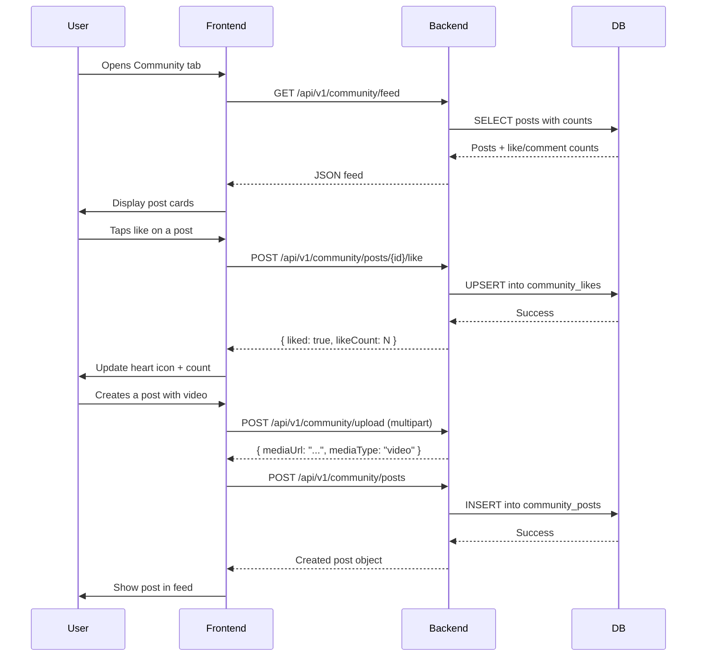

# Community Section — Design Plan

## Overview
Add a "Community" section to the Danger Emergence app where users can post videos/photos of incidents happening in their environment. Other users can like, comment, share, and add posts to favorites. This creates a crowdsourced situational awareness feed.

---

## 1. Database Schema (New Migration: V14)

### Table: `community_posts`
```sql
CREATE TABLE IF NOT EXISTS community_posts (
    id VARCHAR(36) PRIMARY KEY,
    user_id VARCHAR(36) REFERENCES users(id),
    caption TEXT,
    media_url VARCHAR(512) NOT NULL,
    media_type VARCHAR(20) NOT NULL DEFAULT 'image',  -- 'image' | 'video'
    latitude DOUBLE PRECISION,
    longitude DOUBLE PRECISION,
    location_name VARCHAR(255),
    is_anonymous BOOLEAN DEFAULT false,
    status VARCHAR(20) NOT NULL DEFAULT 'active',     -- 'active' | 'flagged' | 'removed'
    created_at TIMESTAMP DEFAULT CURRENT_TIMESTAMP,
    updated_at TIMESTAMP DEFAULT CURRENT_TIMESTAMP
);
```

### Table: `community_likes`
```sql
CREATE TABLE IF NOT EXISTS community_likes (
    id VARCHAR(36) PRIMARY KEY,
    post_id VARCHAR(36) REFERENCES community_posts(id) ON DELETE CASCADE,
    user_id VARCHAR(36) REFERENCES users(id),
    created_at TIMESTAMP DEFAULT CURRENT_TIMESTAMP,
    UNIQUE(post_id, user_id)
);
```

### Table: `community_comments`
```sql
CREATE TABLE IF NOT EXISTS community_comments (
    id VARCHAR(36) PRIMARY KEY,
    post_id VARCHAR(36) REFERENCES community_posts(id) ON DELETE CASCADE,
    user_id VARCHAR(36) REFERENCES users(id),
    content TEXT NOT NULL,
    created_at TIMESTAMP DEFAULT CURRENT_TIMESTAMP,
    updated_at TIMESTAMP DEFAULT CURRENT_TIMESTAMP
);
```

### Table: `community_favorites`
```sql
CREATE TABLE IF NOT EXISTS community_favorites (
    id VARCHAR(36) PRIMARY KEY,
    post_id VARCHAR(36) REFERENCES community_posts(id) ON DELETE CASCADE,
    user_id VARCHAR(36) REFERENCES users(id),
    created_at TIMESTAMP DEFAULT CURRENT_TIMESTAMP,
    UNIQUE(post_id, user_id)
);
```

### Table: `community_shares`
```sql
CREATE TABLE IF NOT EXISTS community_shares (
    id VARCHAR(36) PRIMARY KEY,
    post_id VARCHAR(36) REFERENCES community_posts(id) ON DELETE CASCADE,
    user_id VARCHAR(36) REFERENCES users(id),
    platform VARCHAR(50) DEFAULT 'internal',  -- 'internal' | 'whatsapp' | 'twitter' | etc.
    created_at TIMESTAMP DEFAULT CURRENT_TIMESTAMP
);
```

---

## 2. Backend — New Files

### 2.1 Model: `CommunityPost.java`
- Package: `com.dangeremergence.model`
- Fields: id, user (ManyToOne User), caption, mediaUrl, mediaType (enum), latitude, longitude, locationName, isAnonymous, status (enum), createdAt, updatedAt
- Enums: `MediaType { image, video }`, `PostStatus { active, flagged, removed }`

### 2.2 Model: `CommunityLike.java`
- Fields: id, post (ManyToOne CommunityPost), user (ManyToOne User), createdAt
- Unique constraint on (post, user)

### 2.3 Model: `CommunityComment.java`
- Fields: id, post (ManyToOne CommunityPost), user (ManyToOne User), content, createdAt, updatedAt

### 2.4 Model: `CommunityFavorite.java`
- Fields: id, post (ManyToOne CommunityPost), user (ManyToOne User), createdAt
- Unique constraint on (post, user)

### 2.5 Model: `CommunityShare.java`
- Fields: id, post (ManyToOne CommunityPost), user (ManyToOne User), platform, createdAt

### 2.6 Repository: `CommunityPostRepository.java`
- `findByStatusOrderByCreatedAtDesc(PostStatus status)`
- `findByUserIdAndStatusOrderByCreatedAtDesc(String userId, PostStatus status)`
- `countByPostId(String postId)` — for likes/comments count

### 2.7 Repository: `CommunityLikeRepository.java`
- `findByPostIdAndUserId(String postId, String userId)`
- `countByPostId(String postId)`
- `deleteByPostIdAndUserId(String postId, String userId)`

### 2.8 Repository: `CommunityCommentRepository.java`
- `findByPostIdOrderByCreatedAtAsc(String postId)`
- `countByPostId(String postId)`

### 2.9 Repository: `CommunityFavoriteRepository.java`
- `findByPostIdAndUserId(String postId, String userId)`
- `findByUserIdOrderByCreatedAtDesc(String userId)`
- `countByPostId(String postId)`

### 2.10 Repository: `CommunityShareRepository.java`
- `countByPostId(String postId)`

### 2.11 Service: `CommunityService.java`
- `createPost(userId, caption, mediaUrl, mediaType, latitude, longitude, locationName, isAnonymous)`
- `getFeed(page, size)` — paginated feed of active posts with like/comment counts
- `getPostById(postId, currentUserId)` — single post with interaction status
- `toggleLike(postId, userId)` — like/unlike
- `addComment(postId, userId, content)`
- `deleteComment(commentId, userId)`
- `toggleFavorite(postId, userId)` — favorite/unfavorite
- `recordShare(postId, userId, platform)`
- `getUserPosts(userId)` — user's own posts
- `getUserFavorites(userId)` — user's favorited posts
- `flagPost(postId, userId)` — flag inappropriate content
- `deletePost(postId, userId)` — soft delete (set status = removed)

### 2.12 Controller: `CommunityController.java`
- `POST /api/v1/community/posts` — create post
- `GET /api/v1/community/feed?page=0&size=20` — paginated feed
- `GET /api/v1/community/posts/{id}` — single post
- `POST /api/v1/community/posts/{id}/like` — toggle like
- `POST /api/v1/community/posts/{id}/comment` — add comment
- `DELETE /api/v1/community/comments/{id}` — delete comment
- `POST /api/v1/community/posts/{id}/favorite` — toggle favorite
- `POST /api/v1/community/posts/{id}/share` — record share
- `GET /api/v1/community/my-posts` — user's posts
- `GET /api/v1/community/my-favorites` — user's favorites
- `DELETE /api/v1/community/posts/{id}` — delete own post

### 2.13 Media Upload Support
- Add file upload endpoint or integrate with existing media service
- `POST /api/v1/community/upload` — multipart file upload, returns media URL
- Store files in a configurable directory (local filesystem or S3-compatible)

---

## 3. Frontend — New Module

### 3.1 Module Structure
```
frontend/lib/modules/community/
  models/
    community_post.dart
    community_comment.dart
  screens/
    community_feed_screen.dart      -- Main feed (video/image cards)
    create_post_screen.dart         -- Camera/gallery + caption
    post_detail_screen.dart         -- Single post with comments
    user_posts_screen.dart          -- User's own posts
    favorites_screen.dart           -- User's favorites
  services/
    community_service.dart          -- API calls
  widgets/
    post_card.dart                  -- Card widget for feed
    comment_tile.dart               -- Comment widget
    like_button.dart                -- Animated like button
    media_player_widget.dart        -- Video/image display
```

### 3.2 Screen Details

#### CommunityFeedScreen
- TabBarView with tabs: "For You", "Nearby", "Trending"
- Infinite scroll pagination
- Pull-to-refresh
- Each post card shows: user avatar/name, media thumbnail, caption, location, like/comment/favorite/share counts
- FAB to create new post

#### CreatePostScreen
- Camera capture or gallery picker (using `image_picker` package)
- Caption text field
- Location toggle (attach current location)
- Anonymous toggle
- Media preview before posting

#### PostDetailScreen
- Full media view (video player for videos)
- Caption and metadata
- Like button with count
- Comment section with real-time updates
- Favorite button
- Share button (internal + external share sheet)

### 3.3 Service: `CommunityService`
- Methods mirroring the backend API endpoints
- Uses `BackendApi` singleton for HTTP calls
- Handles pagination state

### 3.4 Route Registration
Add to `AppRoutes` in `routes.dart`:
```dart
static const String community = '/community';
static const String createPost = '/community/create';
static const String postDetail = '/community/post';
static const String userPosts = '/community/my-posts';
static const String favorites = '/community/favorites';
```

### 3.5 Navigation
- Add "Community" tab to the bottom navigation bar in `DashboardScreen`
- Or add a community icon in the app bar

---

## 4. Data Flow



---

## 5. Dependencies to Add

### Backend (pom.xml)
- No new dependencies needed (Spring Boot already has JPA, Web, Multipart)

### Frontend (pubspec.yaml)
- `image_picker` — camera/gallery access
- `video_player` — play videos in feed
- `chewie` — video player UI wrapper (optional)
- `cached_network_image` — efficient image loading
- `geolocator` — get current location for posts
- `share_plus` — share posts externally

---

## 6. Implementation Order

1. Database migration (V14)
2. Backend models (CommunityPost, CommunityLike, CommunityComment, CommunityFavorite, CommunityShare)
3. Backend repositories
4. Backend service (CommunityService)
5. Backend controller (CommunityController)
6. Backend media upload endpoint
7. Frontend models (Dart data classes)
8. Frontend service (CommunityService API client)
9. Frontend widgets (PostCard, LikeButton, CommentTile, MediaPlayer)
10. Frontend screens (Feed, Create, Detail, MyPosts, Favorites)
11. Route registration and navigation integration
12. Testing and verification
