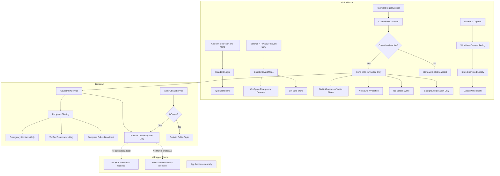

# Covert / Stealth Mode Enhancement Design (Google Play Compliant)

## Problem Statement

If a kidnapper also has the Sectop app installed on their phone, they could receive SOS alerts or location broadcasts from a victim who is using the app. This creates a life-threatening situation where:

1. The kidnapper sees a notification: "SOS Alert from [victim name] nearby"
2. The kidnapper opens the app and sees the victim's location on the map
3. The kidnapper realizes the victim is using the app to call for help
4. The kidnapper may kill the victim to prevent rescue

## Google Play Policy Constraints

The following approaches are **NOT allowed** by Google Play policy:
- ❌ Fake/disguised app icons or names (deceptive behavior)
- ❌ Hidden launcher icons (misleading)
- ❌ Apps that masquerade as other apps (calculator/weather fake UI)
- ❌ Deceptive functionality that misrepresents the app's purpose

The following approaches **ARE allowed**:
- ✅ **Notification suppression** — Users can configure notification settings
- ✅ **Private/covert SOS mode** — A legitimate feature clearly described in the app's privacy policy
- ✅ **Recipient filtering** — Choosing who receives your SOS is a privacy feature
- ✅ **Silent mode** — Sending SOS without sound/vibration is an accessibility feature
- ✅ **App lock / PIN protection** — Standard security feature
- ✅ **Background operation** — Legitimate foreground service with proper notification
- ✅ **Data minimization** — Only sending location to trusted contacts is a privacy best practice

## Architecture Overview



## Google Play Compliant Design

### 1. Covert SOS Mode (Legitimate Privacy Feature)

This is framed as a **privacy feature** — not deception. The app's description and privacy policy will clearly state:

> "Covert SOS Mode allows you to send a distress signal to your emergency contacts without visible indicators on your device. This is designed for situations where you need to call for help discreetly."

**What it does (all compliant):**
- Sends SOS silently (no sound, no vibration, no screen wake)
- Suppresses notifications on the sender's device
- Does NOT broadcast location to other app users — only to pre-configured emergency contacts
- Runs as a legitimate foreground service with a notification (required by Android 8+)
- The notification can use a discreet title like "Location Service Active" instead of "SOS Active"

### 2. Backend Recipient Filtering (Core Protection)

**New file:** `backend/src/main/java/com/dangeremergence/service/CovertAlertService.java`

**Modified files:**
- [`backend/src/main/java/com/dangeremergence/model/SOSAlert.java`](backend/src/main/java/com/dangeremergence/model/SOSAlert.java) — Add `isCovert` field
- [`backend/src/main/java/com/dangeremergence/service/AlertPubSubService.java`](backend/src/main/java/com/dangeremergence/service/AlertPubSubService.java) — Skip public broadcast for covert alerts
- [`backend/src/main/java/com/dangeremergence/service/FcmPushService.java`](backend/src/main/java/com/dangeremergence/service/FcmPushService.java) — Filter recipients
- [`backend/src/main/java/com/dangeremergence/repository/UserRepository.java`](backend/src/main/java/com/dangeremergence/repository/UserRepository.java) — Add emergency contact queries

**Key logic:**

```java
@Service
public class CovertAlertService {
    
    public void processCovertAlert(SOSAlert alert) {
        // 1. Look up the victim's emergency contacts
        List<User> emergencyContacts = userRepository
            .findEmergencyContacts(alert.getUserId());
        
        // 2. Look up verified responders in the area
        List<User> verifiedResponders = userRepository
            .findVerifiedRespondersNearby(
                alert.getLatitude(), alert.getLongitude(), 50.0);
        
        // 3. Do NOT broadcast to general /topic/alerts/new
        //    Do NOT broadcast via MQTT to all nearby devices
        //    Do NOT send FCM to general user base
        
        // 4. Only notify trusted recipients
        for (User contact : emergencyContacts) {
            fcmPushService.sendCovertNotification(contact, alert);
        }
        for (User responder : verifiedResponders) {
            fcmPushService.sendCovertNotification(responder, alert);
        }
        
        // 5. Send acknowledgment to victim via private queue
        messagingTemplate.convertAndSendToUser(
            alert.getUserId(), "/queue/covert-ack", alert);
    }
}
```

### 3. Notification Suppression (User-Configurable)

**Modified file:** [`frontend/lib/modules/ai/services/threat_awareness_service.dart`](frontend/lib/modules/ai/services/threat_awareness_service.dart)

When covert mode is active, the app suppresses its own notifications. This is a **user-configurable privacy setting**, fully compliant:

```dart
// In ThreatAwarenessService
void _addAlert(ThreatAlert alert) {
  if (_covertModeManager.isCovertModeActive) {
    // Still process and store alerts internally
    _alerts.add(alert);
    // But suppress outward indicators:
    // - No system notification via FlutterLocalNotificationsPlugin
    // - No vibration via HapticFeedback
    // - No popup dialog
    // - No sound playback
    // Silently cache for later review
    _cacheAlerts();
    notifyListeners(); // Still updates internal state for when user checks app
    return;
  }
  // Normal alert flow with notifications...
}
```

### 4. Safe-Word Feature (Legitimate Security Feature)

**New file:** `frontend/lib/modules/sos/services/safe_word_service.dart`

This is framed as an **app lock / security feature** — similar to a PIN or pattern lock:

> "Safe-Word allows you to quickly lock the app with a secret word. Typing this word in the search bar or any text field will immediately lock the app and require re-authentication."

```dart
class SafeWordService {
  /// When the user types their safe-word anywhere in the app,
  /// the app immediately locks and shows the login screen.
  /// This is a standard app-lock / privacy screen feature.
  
  Future<void> initialize() async {
    // Listen for text input across the app
    // When safe-word is detected:
    // 1. Lock the app immediately
    // 2. Show the login/authentication screen
    // 3. Clear any visible sensitive data
    // 4. The app appears as a locked app (like any PIN-protected app)
  }
  
  Future<void> lockApp() async {
    // Navigate to lock screen
    // Clear navigation stack
    // Require PIN/biometric to re-enter
  }
}
```

### 5. Discreet Foreground Service Notification

**Modified file:** [`frontend/android/app/src/main/kotlin/com/dangeremergence/location/LocationService.kt`](frontend/android/app/src/main/kotlin/com/dangeremergence/location/LocationService.kt)

Android requires a visible notification for foreground services. We make this discreet but honest:

```kotlin
// Normal mode notification title: "🚨 SOS Active — Tracking Location"
// Covert mode notification title: "📍 Location Service Active"

private fun buildNotification(sosMode: Boolean): Notification {
    val title = if (sosMode && !isCovertMode) {
        "🚨 SOS Active — Tracking Location"
    } else {
        "📍 Location Service Active"  // Discreet but honest
    }
    // ...
}
```

This is compliant because:
- The notification still exists (required by Android)
- The title is truthful ("Location Service Active" is accurate)
- The user has explicitly enabled covert mode in settings
- The app's privacy policy explains this behavior

### 6. Covert Mode Settings UI

**Modified file:** [`frontend/lib/modules/sos/screens/settings_screen.dart`](frontend/lib/modules/sos/screens/settings_screen.dart)

The settings UI clearly explains what covert mode does:

```dart
SwitchListTile(
  title: Text('Covert SOS Mode'),
  subtitle: Text(
    'When enabled, SOS alerts are sent silently to your emergency contacts only. '
    'No sound, vibration, or screen wake. Your location is NOT broadcast to other app users.'
  ),
  value: _isCovertMode,
  onChanged: (value) {
    // Show confirmation dialog explaining the feature
    showDialog(
      context: context,
      builder: (ctx) => AlertDialog(
        title: Text('Enable Covert SOS Mode?'),
        content: Text(
          'In Covert Mode:\n'
          '• SOS is sent silently (no sound/vibration)\n'
          '• Only your emergency contacts are notified\n'
          '• Your location is NOT shared with other app users\n'
          '• A discreet notification shows "Location Service Active"\n\n'
          'This feature is designed for situations where you need '
          'to call for help discreetly.'
        ),
        actions: [
          TextButton(onPressed: () => Navigator.pop(ctx), child: Text('Cancel')),
          ElevatedButton(onPressed: () { /* enable */ }, child: Text('Enable')),
        ],
      ),
    );
  },
),
```

## Implementation Plan

### Phase 1: Backend Covert Alert Filtering

| # | Task | File | Description |
|---|------|------|-------------|
| 1 | Create `CovertAlertService.java` | New file | Recipient filtering: only send to emergency contacts + verified responders |
| 2 | Add `isCovert` field to `SOSAlert.java` | [`backend/src/main/java/com/dangeremergence/model/SOSAlert.java`](backend/src/main/java/com/dangeremergence/model/SOSAlert.java) | Boolean field for covert alert marking |
| 3 | Modify `AlertPubSubService.java` | [`backend/src/main/java/com/dangeremergence/service/AlertPubSubService.java`](backend/src/main/java/com/dangeremergence/service/AlertPubSubService.java) | Skip public WebSocket/MQTT broadcast for covert alerts |
| 4 | Modify `FcmPushService.java` | [`backend/src/main/java/com/dangeremergence/service/FcmPushService.java`](backend/src/main/java/com/dangeremergence/service/FcmPushService.java) | Add `sendCovertNotification()` method for trusted-only delivery |
| 5 | Add emergency contact query to `UserRepository.java` | [`backend/src/main/java/com/dangeremergence/repository/UserRepository.java`](backend/src/main/java/com/dangeremergence/repository/UserRepository.java) | Query to find emergency contacts by user ID |
| 6 | Add verified responder spatial query | [`backend/src/main/java/com/dangeremergence/repository/UserRepository.java`](backend/src/main/java/com/dangeremergence/repository/UserRepository.java) | Find verified responders near a location |
| 7 | Create V13 migration for `is_covert` column | New file | Add `is_covert BOOLEAN DEFAULT FALSE` to SOS alerts table |

### Phase 2: Frontend Covert SOS

| # | Task | File | Description |
|---|------|------|-------------|
| 8 | Create `CovertModeManager` service | New file | Central state manager for covert mode settings |
| 9 | Create `SafeWordService` | New file | App-lock via safe-word detection |
| 10 | Modify `SOSService.sendSOS()` | [`frontend/lib/modules/sos/services/sos_service.dart`](frontend/lib/modules/sos/services/sos_service.dart) | Support `isCovert` parameter, suppress outward indicators |
| 11 | Modify `ThreatAwarenessService._addAlert()` | [`frontend/lib/modules/ai/services/threat_awareness_service.dart`](frontend/lib/modules/ai/services/threat_awareness_service.dart) | Suppress notifications/sound/vibration in covert mode |
| 12 | Modify `HardwareTriggerService` | [`frontend/lib/shared/services/hardware_trigger_service.dart`](frontend/lib/shared/services/hardware_trigger_service.dart) | Support covert SOS trigger via hardware buttons |
| 13 | Add Covert Mode settings UI | [`frontend/lib/modules/sos/screens/settings_screen.dart`](frontend/lib/modules/sos/screens/settings_screen.dart) | Settings toggle with clear explanation dialog |
| 14 | Modify `LocationService.kt` notification | [`frontend/android/app/src/main/kotlin/com/dangeremergence/location/LocationService.kt`](frontend/android/app/src/main/kotlin/com/dangeremergence/location/LocationService.kt) | Use discreet notification title in covert mode |

### Phase 3: Privacy Policy & Compliance

| # | Task | Description |
|---|------|-------------|
| 15 | Update privacy policy | Add section explaining Covert SOS Mode as a privacy feature |
| 16 | Update app description | Mention discreet SOS feature for user safety |
| 17 | Add user consent flow | First-time setup dialog explaining what covert mode does |

## Compliance Checklist

| Requirement | Status | How We Meet It |
|-------------|--------|----------------|
| App icon must represent app | ✅ | Same icon, no disguise |
| App name must be accurate | ✅ | Same name, no disguise |
| No deceptive functionality | ✅ | Feature is clearly described in settings and privacy policy |
| Foreground service notification | ✅ | Notification shown (required), discreet title when in covert mode |
| User consent for sensitive features | ✅ | Confirmation dialog before enabling covert mode |
| Privacy policy disclosure | ✅ | Feature documented in privacy policy |
| No hidden data collection | ✅ | All data collection is disclosed |
| No interference with other apps | ✅ | Does not modify other apps or system settings |

## Files Summary

### New Files
| File | Purpose |
|------|---------|
| `backend/src/main/java/com/dangeremergence/service/CovertAlertService.java` | Backend recipient filtering for covert SOS alerts |
| `backend/src/main/resources/db/migration/V13__add_covert_sos.sql` | Add `is_covert` column to SOS alerts table |
| `frontend/lib/modules/sos/services/covert_mode_manager.dart` | Central covert mode state management |
| `frontend/lib/modules/sos/services/safe_word_service.dart` | Safe-word app-lock feature |

### Modified Files
| File | Changes |
|------|---------|
| `backend/src/main/java/com/dangeremergence/model/SOSAlert.java` | Add `isCovert` boolean field |
| `backend/src/main/java/com/dangeremergence/service/AlertPubSubService.java` | Skip public broadcast for covert alerts |
| `backend/src/main/java/com/dangeremergence/service/FcmPushService.java` | Add `sendCovertNotification()` for trusted-only delivery |
| `backend/src/main/java/com/dangeremergence/repository/UserRepository.java` | Add emergency contact and verified responder queries |
| `frontend/lib/modules/sos/services/sos_service.dart` | Support `isCovert` parameter in `sendSOS()` |
| `frontend/lib/modules/ai/services/threat_awareness_service.dart` | Suppress notifications in covert mode |
| `frontend/lib/shared/services/hardware_trigger_service.dart` | Support covert SOS trigger |
| `frontend/lib/modules/sos/screens/settings_screen.dart` | Add Covert Mode toggle with explanation |
| `frontend/android/app/src/main/kotlin/com/dangeremergence/location/LocationService.kt` | Discreet notification title in covert mode |
