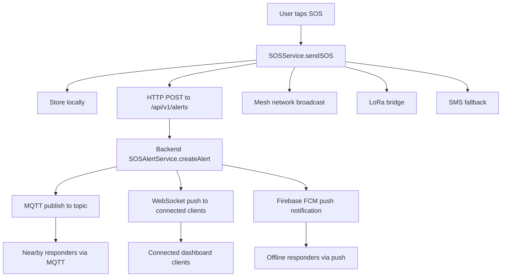
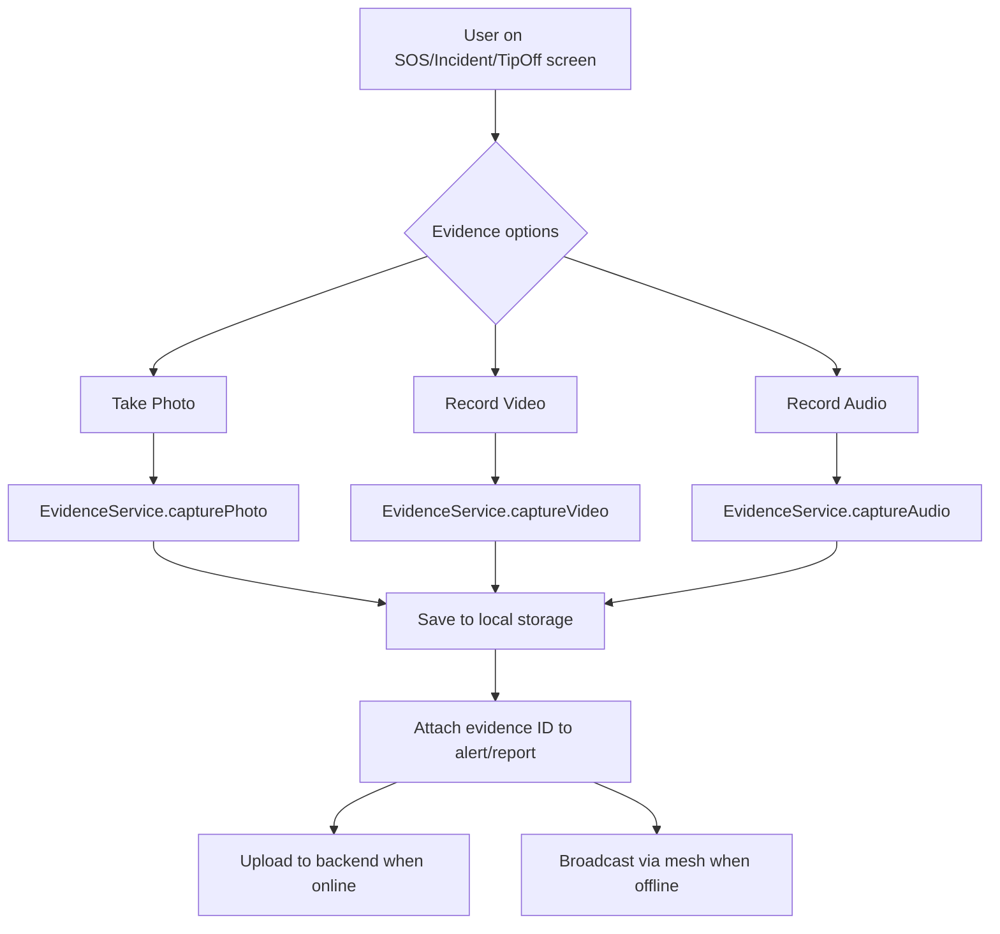

# Fast Message Delivery & Evidence Collection Design

## Problem Statement

The user identified two critical gaps for an emergency application:

1. **Message delivery speed** - Emergency alerts must reach responders instantly, not just via polling/HTTP
2. **Evidence collection** - Video, voice, and photo evidence must be captured and attached to alerts/reports

## Current State Analysis

### Message Delivery (Current)
- SOS alerts are sent via HTTP POST to backend API
- Backend publishes to MQTT topics (`alerts/{state}/{lga}`, `guardians/{state}/{lga}`)
- Mesh network (Bluetooth) broadcast for offline scenarios
- LoRa bridge for long-range offline
- SMS fallback (placeholder only)
- **Missing:** WebSocket/STOMP real-time push to connected clients, Firebase Cloud Messaging push notifications

### Evidence Collection (Current)
- `EvidenceService.captureLastGasp()` exists but `_recordQuickAudio()` and `_takeQuickPhoto()` return `null` (placeholders)
- No video recording support at all
- No UI for attaching evidence to tip-offs or incident reports
- No evidence gallery/viewer

## Proposed Architecture

### Part 1: Fast Message Delivery



### Part 2: Evidence Collection



## Files to Modify/Create

### Frontend Changes

#### 1. Evidence Service - Full Implementation
**File:** [`frontend/lib/shared/services/evidence_service.dart`](frontend/lib/shared/services/evidence_service.dart)

Replace placeholder methods with real implementations:
- `capturePhoto()` - Use `image_picker` package to take photo, save to app directory, return file path
- `captureVideo()` - Use `image_picker` or `camera` package to record video, save to app directory, return file path
- `captureAudio()` - Use `record` or `flutter_sound` package to record audio, save to app directory, return file path
- `captureLastGasp()` - Keep existing but call real methods instead of placeholders
- `getEvidenceFiles(String alertId)` - Retrieve all evidence files for a given alert
- `uploadEvidence(String alertId)` - Upload all pending evidence to backend
- `deleteEvidence(String filePath)` - Remove evidence file

#### 2. SOS Screen - Add Evidence Capture
**File:** [`frontend/lib/modules/sos/screens/sos_screen.dart`](frontend/lib/modules/sos/screens/sos_screen.dart)

Add evidence capture buttons before the SOS button:
- Camera icon button to take photo
- Video icon button to record video
- Mic icon button to record audio
- Show thumbnail previews of captured evidence
- Send evidence IDs along with SOS alert

#### 3. Incident Report Screen - Add Evidence Capture
**File:** [`frontend/lib/modules/sos/screens/incident_report_screen.dart`](frontend/lib/modules/sos/screens/incident_report_screen.dart)

Add evidence section after description field:
- "Attach Evidence" section with photo/video/audio buttons
- Evidence preview thumbnails
- Include evidence file paths in the report submission

#### 4. Tip-Off Screen - Add Evidence Capture
**File:** [`frontend/lib/modules/sos/screens/tip_off_screen.dart`](frontend/lib/modules/sos/screens/tip_off_screen.dart)

Add evidence attachment section:
- Photo/video/audio capture buttons
- Evidence preview
- Include evidence in tip submission

#### 5. SOS Service - Add WebSocket Connection
**File:** [`frontend/lib/modules/sos/services/sos_service.dart`](frontend/lib/modules/sos/services/sos_service.dart)

Add WebSocket/STOMP client for real-time delivery confirmation:
- Connect to `ws://{host}/ws` via STOMP protocol
- Subscribe to `/user/queue/alerts` for personal alert status
- Subscribe to `/topic/alerts` for broadcast alerts
- Auto-reconnect with exponential backoff
- Update alert status in real-time when responder acknowledges

#### 6. Backend API - Add Evidence Upload Endpoints
**File:** [`frontend/lib/shared/services/backend_api.dart`](frontend/lib/shared/services/backend_api.dart)

Add methods:
- `uploadEvidence(String alertId, String filePath, String fileType)` - Upload evidence file
- `getEvidence(String alertId)` - Get evidence metadata for an alert
- `getEvidenceDownloadUrl(String evidenceId)` - Get download URL for evidence

#### 7. pubspec.yaml - Add Required Packages
**File:** [`frontend/pubspec.yaml`](frontend/pubspec.yaml)

Add dependencies:
- `image_picker: ^1.0.4` - Camera/gallery access
- `record: ^5.0.0` - Audio recording
- `video_player: ^2.8.1` - Video playback
- `stomp_dart_client: ^1.0.0` - WebSocket STOMP client
- `firebase_messaging: ^14.7.10` - Push notifications
- `flutter_local_notifications: ^16.3.0` - Local notifications

### Backend Changes

#### 8. Evidence Controller - New REST Controller
**File:** `backend/src/main/java/com/dangeremergence/controller/EvidenceController.java` (NEW)

Endpoints:
- `POST /api/v1/evidence/upload` - Upload evidence file (multipart)
- `GET /api/v1/evidence/{alertId}` - Get evidence list for alert
- `GET /api/v1/evidence/file/{evidenceId}` - Download evidence file
- `DELETE /api/v1/evidence/{evidenceId}` - Delete evidence

#### 9. Evidence Model
**File:** `backend/src/main/java/com/dangeremergence/model/Evidence.java` (NEW)

Fields:
- `id` (String, UUID)
- `alertId` (String, foreign key to SOSAlert/Incident/TipOff)
- `userId` (String)
- `fileType` (enum: PHOTO, VIDEO, AUDIO)
- `filePath` (String - server storage path)
- `fileSize` (long)
- `mimeType` (String)
- `createdAt` (LocalDateTime)
- `sourceType` (enum: SOS, INCIDENT, TIP_OFF)

#### 10. Evidence Repository
**File:** `backend/src/main/java/com/dangeremergence/repository/EvidenceRepository.java` (NEW)

#### 11. Evidence Service
**File:** `backend/src/main/java/com/dangeremergence/service/EvidenceService.java` (NEW)

- Store files on disk (configurable path)
- Serve files via streaming
- Cleanup old evidence

#### 12. WebSocket Push in SOSAlertService
**File:** [`backend/src/main/java/com/dangeremergence/service/SOSAlertService.java`](backend/src/main/java/com/dangeremergence/service/SOSAlertService.java)

Add `SimpMessagingTemplate` injection:
- After creating alert, push to `/topic/alerts/new` (broadcast)
- Push to `/queue/alerts/{userId}` (personal to the sender for confirmation)
- Push to `/topic/alerts/{state}/{lga}` (geo-targeted to responders)

#### 13. Database Migration - Evidence Table
**File:** `backend/src/main/resources/db/migration/V10__add_evidence.sql` (NEW)

```sql
CREATE TABLE evidence (
    id VARCHAR(36) PRIMARY KEY,
    alert_id VARCHAR(36) NOT NULL,
    user_id VARCHAR(36),
    file_type VARCHAR(10) NOT NULL,
    file_path VARCHAR(500) NOT NULL,
    file_size BIGINT,
    mime_type VARCHAR(100),
    source_type VARCHAR(20) NOT NULL,
    created_at TIMESTAMP DEFAULT CURRENT_TIMESTAMP,
    INDEX idx_evidence_alert (alert_id),
    INDEX idx_evidence_user (user_id)
);
```

## Implementation Order

1. **Add packages to pubspec.yaml** - Required dependencies first
2. **Implement EvidenceService** - Replace placeholders with real photo/video/audio capture
3. **Create backend Evidence model, repo, service, controller** - Server-side evidence storage
4. **Add evidence upload to BackendApi** - Frontend API methods
5. **Update SOS screen** - Add evidence capture buttons
6. **Update Incident Report screen** - Add evidence attachment
7. **Update Tip-Off screen** - Add evidence attachment
8. **Add WebSocket/STOMP to SOSService** - Real-time delivery confirmation
9. **Add WebSocket push to SOSAlertService** - Server-side push
10. **Add FCM push notifications** - Offline responder notification
11. **Database migration** - Evidence table

## Key Design Decisions

1. **Evidence stored locally first, uploaded async** - Critical for offline-first emergency app
2. **WebSocket for real-time, not polling** - Instant delivery status updates
3. **Evidence attached to alerts by ID** - Not embedded in the alert payload (avoids large messages)
4. **Mesh broadcast for evidence in offline mode** - Chunked if necessary for large files
5. **Evidence auto-captured on SOS (last gasp)** - Even if user doesn't manually add evidence
