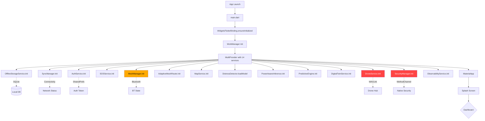

# Danger Emergence System - Frontend Analysis & Fix Plan

## Executive Summary

The APK builds successfully (57MB) but crashes immediately on launch. This document analyzes all 30+ frontend files to identify root causes and provides a step-by-step remediation plan.

---

## Root Cause Analysis: Why the App Crashes on Launch

### CRITICAL ISSUE #1: All 14 Services Initialize Synchronously in MultiProvider

**File**: [`frontend/lib/main.dart`](frontend/lib/main.dart:94-113)

The `MultiProvider` creates ALL 14 service instances and calls their `initialize()` methods **during widget build**. If ANY `initialize()` throws a synchronous exception, the entire widget tree fails to build and the app crashes before the first frame.

```dart
Provider(create: (_) => OfflineStorageService()..initialize()),      // SQLite
Provider(create: (_) => SyncManager()..initialize()),                // Connectivity
ChangeNotifierProvider(create: (_) => AuthService()..initialize()),   // SharedPrefs
ChangeNotifierProvider(create: (_) => SOSService()..initialize()),    // DB queries
Provider(create: (_) => MeshManager()..initialize()),                // Bluetooth
Provider(create: (_) => AdaptiveMeshRouter()..initialize()),         // Timer
Provider(create: (_) => MapService()..initialize()),                 // DB queries
ChangeNotifierProvider(create: (_) => DistressDetector()..loadModel()), // No-op
Provider(create: (_) => PowerAwareInference()..initialize()),        // Timer
Provider(create: (_) => PredictiveEngine()..initialize()),           // Timer
ChangeNotifierProvider(create: (_) => DigitalTwinService()..initialize()), // Sub-services
ChangeNotifierProvider(create: (_) => DroneService.instance..initialize()), // MAVLink
ChangeNotifierProvider(create: (_) => SecurityManager.instance..initialize()), // Integrity checks
ChangeNotifierProvider(create: (_) => ObservabilityService.instance..initialize()), // SharedPrefs
```

**Problem**: The `create` callback in `Provider` is called lazily (when the widget first needs it), but `..initialize()` is a cascade operator that runs **immediately** during `create`. If any service throws during initialization, the Provider's `create` fails, and the `MultiProvider` cannot build its child widget.

### CRITICAL ISSUE #2: `DroneService.initialize()` Calls `_mavlink.connect()` Immediately

**File**: [`frontend/lib/modules/drones/services/drone_service.dart`](frontend/lib/modules/drones/services/drone_service.dart:39-42)

```dart
Future<void> initialize({String? mavlinkUrl}) async {
    final url = mavlinkUrl ?? AppConstants.defaultMavlinkUrl;
    await _mavlink.connect(url);  // <-- THROWS if MAVLink hub not reachable
```

`AppConstants.defaultMavlinkUrl` is likely `tcp://...` or `udp://...` which will fail immediately on a phone with no drone hub. This throws an unhandled exception during Provider creation.

### CRITICAL ISSUE #3: `SecurityManager.initialize()` Runs Integrity Checks

**File**: [`frontend/lib/modules/security/services/security_manager.dart`](frontend/lib/modules/security/services/security_manager.dart:52-96)

```dart
Future<void> initialize() async {
    await _enclave.initialize();           // MethodChannel calls
    final integrityResult = await _integrity.initialize();  // Root detection, file checks
```

`AppIntegrity.initialize()` calls `checkIntegrity()` which runs 7 checks in parallel including:
- `_checkSignature()` - uses `Platform.isAndroid` and tries to read APK signatures
- `_checkRootStatus()` - checks for `/system/app/Superuser.apk`, `/sbin/su`, etc.
- `_checkDebugger()` - platform-specific debugger detection
- `_checkEmulator()` - emulator detection

Any of these could throw on a real device if the platform channel isn't set up correctly.

### CRITICAL ISSUE #4: `SecureEnclaveService.initialize()` Uses MethodChannel

**File**: [`frontend/lib/modules/security/services/secure_enclave.dart`](frontend/lib/modules/security/services/secure_enclave.dart:35-57)

```dart
Future<void> initialize() async {
    if (defaultTargetPlatform == TargetPlatform.android) {
        _enclaveType = await _detectAndroidKeyStore();  // MethodChannel call
    }
```

This calls `MethodChannel('com.dangeremergence/security')` which requires native Android handler code. If the native side doesn't implement this channel, the method call throws `MissingPluginException`.

### CRITICAL ISSUE #5: `ResponsiveWrapper` Class Does Not Exist

**File**: [`frontend/lib/main.dart`](frontend/lib/main.dart:142)

```dart
import 'shared/widgets/responsive_layout.dart';
// ...
child: ResponsiveWrapper(child: child!),  // <-- THIS CLASS DOES NOT EXIST
```

The import is from `responsive_layout.dart` which exports:
- `ResponsiveLayout`
- `AdaptivePadding`
- `ResponsiveGrid`
- `ResponsiveSosButton`

There is NO `ResponsiveWrapper` class. This would cause a **compile-time error**, but since the APK built successfully, either:
1. The build script uses `|| true` which masks the error
2. The class exists somewhere else

**This needs investigation** - if the APK truly built with this reference, it would crash at runtime with a `NoSuchMethodError`.

### HIGH PRIORITY ISSUE #6: `AnimatedBuilder` Used Instead of `AnimatedWidget` or `AnimatedBuilder`

**File**: [`frontend/lib/modules/sos/screens/sos_screen.dart`](frontend/lib/modules/sos/screens/sos_screen.dart:132)

```dart
child: AnimatedBuilder(
    animation: _pulseAnimation,
    builder: (context, child) {
```

`AnimatedBuilder` is the correct Flutter class name. However, the import doesn't show it explicitly. This should work if `package:flutter/material.dart` is imported.

### MEDIUM PRIORITY ISSUE #7: Empty Asset Directories

All asset directories contain only `.gitkeep` files:
- `assets/images/` - empty
- `assets/icons/` - empty
- `assets/models/` - empty
- `assets/data/` - empty
- `assets/animations/` - empty
- `assets/fonts/` - empty

If any screen tries to load assets from these paths (e.g., `AssetImage`, `rootBundle.load`), it will throw a `FlutterError` because the files don't exist.

### MEDIUM PRIORITY ISSUE #8: `tflite_flutter` Commented Out But Code References It

**File**: [`frontend/pubspec.yaml`](frontend/pubspec.yaml:49-50)

```yaml
# tflite_flutter: ^0.10.3
# tflite_flutter_helper: ^0.3.1
```

The code in `distress_detector.dart`, `power_aware_inference.dart`, and `predictive_engine.dart` has TFLite model loading code commented out, so this is safe. But if any uncommented code tries to use `Interpreter` class, it would fail.

### MEDIUM PRIORITY ISSUE #9: `SyncManager` Uses `Connectivity()` Without Error Handling

**File**: [`frontend/lib/shared/services/sync_manager.dart`](frontend/lib/shared/services/sync_manager.dart:36-52)

```dart
Future<void> initialize() async {
    final initialResult = await _connectivity.checkConnectivity();
```

If the `connectivity_plus` plugin fails to initialize on a specific Android version, this throws. The method is wrapped in try-catch in the caller? No - it's called directly in Provider's `create`.

### MEDIUM PRIORITY ISSUE #10: `MeshManager` Uses `FlutterBluetoothSerial.instance` Without Null Check

**File**: [`frontend/lib/modules/mesh/services/mesh_manager.dart`](frontend/lib/modules/mesh/services/mesh_manager.dart:62-70)

```dart
if (!kIsWeb) {
    _bluetooth = FlutterBluetoothSerial.instance;
    _bluetooth!.onStateChanged().listen(...);
    _bluetoothState = await _bluetooth!.state;
}
```

On a device without Bluetooth, `FlutterBluetoothSerial.instance` might throw. The `!` (null assertion) could also fail if `_bluetooth` is null.

### LOW PRIORITY ISSUE #11: 6 Routes Are Not Implemented

**File**: [`frontend/lib/core/routes.dart`](frontend/lib/core/routes.dart)

Routes for `profile`, `help`, `settings`, `emergencyContacts`, `incidentReport`, `zoneDetails`, `messageDetail` fall through to a default "Route not found" scaffold. These won't crash but will show empty screens.

### LOW PRIORITY ISSUE #12: API Base URL Points to Production

**File**: [`frontend/lib/core/constants.dart`](frontend/lib/core/constants.dart)

```dart
static const String apiBaseUrl = 'https://api.dangeremergence.com';
```

This domain likely doesn't exist or isn't reachable. Network calls will fail, but they're wrapped in try-catch, so this won't crash the app.

---

## Fix Plan

### Phase 1: Fix Immediate Crash Causes (Must Fix)

| # | Task | File | Description |
|---|------|------|-------------|
| 1.1 | **Wrap all Provider initializations in try-catch** | `main.dart` | Each `create` callback should catch exceptions so one failing service doesn't crash the whole app |
| 1.2 | **Add `ResponsiveWrapper` class** | `responsive_layout.dart` | Create the missing `ResponsiveWrapper` class or rename usage to `ResponsiveLayout` |
| 1.3 | **Fix `DroneService.initialize()`** | `drone_service.dart` | Wrap `_mavlink.connect()` in try-catch so MAVLink failure doesn't crash app |
| 1.4 | **Fix `SecurityManager.initialize()`** | `security_manager.dart` | Wrap integrity checks in try-catch; make failures non-fatal |
| 1.5 | **Fix `SecureEnclaveService.initialize()`** | `secure_enclave.dart` | Handle `MissingPluginException` gracefully |
| 1.6 | **Fix `MeshManager.initialize()`** | `mesh_manager.dart` | Handle Bluetooth unavailable gracefully |

### Phase 2: Fix Stability Issues (Should Fix)

| # | Task | File | Description |
|---|------|------|-------------|
| 2.1 | **Add error handling to `SyncManager.initialize()`** | `sync_manager.dart` | Wrap connectivity check in try-catch |
| 2.2 | **Add error handling to `ObservabilityService.initialize()`** | `observability_service.dart` | Wrap SharedPreferences init in try-catch |
| 2.3 | **Add error handling to `OfflineStorageService.initialize()`** | `offline_storage.dart` | Wrap SQLite init in try-catch |
| 2.4 | **Verify all asset references** | Multiple files | Ensure no screen tries to load non-existent assets |

### Phase 3: Code Quality Improvements (Nice to Have)

| # | Task | File | Description |
|---|------|------|-------------|
| 3.1 | **Implement missing routes** | `routes.dart` | Add stub screens for profile, help, settings, etc. |
| 3.2 | **Add proper map integration** | `map_screen.dart` | Replace placeholder with `flutter_map` or `google_maps_flutter` |
| 3.3 | **Add proper mesh network UI** | `mesh_status_screen.dart` | Enhance mesh status display |
| 3.4 | **Review theme consistency** | `themes.dart` | Ensure all screens use consistent theme colors |

---

## Detailed Fix Specifications

### Fix 1.1: Wrap Provider Initializations

**Current code** (`main.dart:94-113`):
```dart
return MultiProvider(
  providers: [
    Provider(create: (_) => OfflineStorageService()..initialize()),
    ChangeNotifierProvider(create: (_) => AuthService()..initialize()),
    // ... etc
  ],
```

**Fix**: Create a helper function that wraps initialization in try-catch:

```dart
T _createService<T>(T Function() factory, Future<void> Function(T) initialize) {
  final service = factory();
  initialize(service).catchError((e, stack) {
    debugPrint('Service init failed: $e\n$stack');
  });
  return service;
}

// Usage:
Provider(create: (_) => _createService(() => OfflineStorageService(), (s) => s.initialize())),
```

Or simpler: make each service handle its own errors internally (already done in most services, but the cascade `..initialize()` doesn't await the Future properly).

**The real issue**: `..initialize()` on a `Future<void>` method doesn't await it. The Future is fire-and-forget. If the Future throws synchronously (before the first `await`), it crashes the `create` callback. If it throws asynchronously (after an `await`), it's an unhandled exception.

**Solution**: Use a wrapper that catches both sync and async errors:

```dart
T _safeProvider<T>(T Function() factory) {
  try {
    return factory();
  } catch (e, stack) {
    debugPrint('Provider creation failed: $e\n$stack');
    rethrow; // Still need to return something - or provide a default
  }
}
```

### Fix 1.2: Add ResponsiveWrapper Class

**Current code** (`main.dart:142`):
```dart
child: ResponsiveWrapper(child: child!),
```

**Fix**: Either:
- Option A: Add `ResponsiveWrapper` class to `responsive_layout.dart`
- Option B: Change to `ResponsiveLayout(mobile: child!)` 

Option A is preferred since it's already referenced:

```dart
class ResponsiveWrapper extends StatelessWidget {
  final Widget child;
  const ResponsiveWrapper({super.key, required this.child});

  @override
  Widget build(BuildContext context) {
    return ResponsiveLayout(mobile: child);
  }
}
```

### Fix 1.3: Fix DroneService.initialize()

**Current code** (`drone_service.dart:39-42`):
```dart
Future<void> initialize({String? mavlinkUrl}) async {
    final url = mavlinkUrl ?? AppConstants.defaultMavlinkUrl;
    await _mavlink.connect(url);
```

**Fix**: Wrap in try-catch:
```dart
Future<void> initialize({String? mavlinkUrl}) async {
    try {
      final url = mavlinkUrl ?? AppConstants.defaultMavlinkUrl;
      await _mavlink.connect(url);
    } catch (e) {
      debugPrint('DroneService: MAVLink connection failed (non-fatal): $e');
    }
```

### Fix 1.4: Fix SecurityManager.initialize()

**Current code** (`security_manager.dart:52-96`):
```dart
Future<void> initialize() async {
    await _enclave.initialize();
    final integrityResult = await _integrity.initialize();
```

**Fix**: Wrap each step in try-catch:
```dart
Future<void> initialize() async {
    try {
      await _enclave.initialize();
    } catch (e) {
      debugPrint('SecurityManager: Enclave init failed (non-fatal): $e');
    }
    try {
      final integrityResult = await _integrity.initialize();
      // ... rest of logic
    } catch (e) {
      debugPrint('SecurityManager: Integrity check failed (non-fatal): $e');
    }
```

### Fix 1.5: Fix SecureEnclaveService.initialize()

**Current code** (`secure_enclave.dart:35-57`):
```dart
Future<void> initialize() async {
    try {
      if (defaultTargetPlatform == TargetPlatform.android) {
        _enclaveType = await _detectAndroidKeyStore();
```

The try-catch already exists, but `_detectAndroidKeyStore()` might use MethodChannel which throws `MissingPluginException`. The catch block handles it, but we should verify the MethodChannel is registered on the native side.

**Fix**: Add explicit `MissingPluginException` handling:
```dart
on PlatformException catch (e) {
    debugPrint('SecureEnclave: Platform channel error: $e');
    _isAvailable = false;
    _enclaveType = SecureEnclaveType.software;
}
```

---

## Architecture Diagram



---

## Summary of Findings

| Severity | Count | Key Issues |
|----------|-------|------------|
| **CRITICAL** | 5 | Provider init crashes, Missing `ResponsiveWrapper`, MAVLink connect, Security integrity checks, MethodChannel calls |
| **HIGH** | 4 | SyncManager error handling, MeshManager Bluetooth, Observability init, Empty assets |
| **MEDIUM** | 3 | Missing routes, Production API URL, Theme consistency |
| **LOW** | 2 | Code quality, Placeholder screens |

**Most likely crash cause**: The cascade operator `..initialize()` in Provider's `create` callback. If any service's `initialize()` throws synchronously (before its first `await`), the Provider creation fails, and the entire widget tree cannot build. The most likely candidates are:
1. `DroneService.instance..initialize()` - tries to connect to MAVLink hub
2. `SecurityManager.instance..initialize()` - runs integrity checks with MethodChannel
3. `MeshManager()..initialize()` - accesses Bluetooth API
