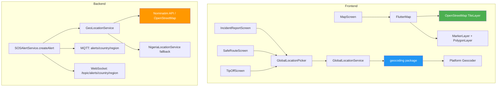

# Global Online Maps Migration Plan

## Current State Analysis

### What already works (no changes needed):
1. **Map tiles are already online**: Both [`MapScreen`](frontend/lib/modules/maps/screens/map_screen.dart:318) and [`SafeRouteScreen`](frontend/lib/modules/sos/screens/safe_route_screen.dart:589) use `flutter_map` with OpenStreetMap tiles (`https://tile.openstreetmap.org/{z}/{x}/{y}.png`). These tiles work globally — no Nigeria restriction.
2. **`geocoding` package already in pubspec.yaml** (line 41): The `geocoding: ^2.1.1` package can resolve addresses to coordinates globally using platform APIs (Google on Android, Apple on iOS).
3. **`geolocator` package already in pubspec.yaml** (line 40): GPS location tracking already works globally.

### What is Nigeria-specific and needs change:

| Component | File | Issue |
|-----------|------|-------|
| `NigeriaLocationService` (frontend) | [`frontend/lib/shared/services/nigeria_location_service.dart`](frontend/lib/shared/services/nigeria_location_service.dart) | Hardcoded list of 36 Nigerian states + FCT with towns. Only works for Nigeria. |
| `NigeriaLocationPicker` (widget) | [`frontend/lib/shared/widgets/nigeria_location_picker.dart`](frontend/lib/shared/widgets/nigeria_location_picker.dart) | UI widget that uses `NigeriaLocationService` for state/town selection. Nigeria-only. |
| `NigeriaLocationService.java` (backend) | [`backend/src/main/java/com/dangeremergence/service/NigeriaLocationService.java`](backend/src/main/java/com/dangeremergence/service/NigeriaLocationService.java) | Reverse geocodes GPS coordinates to Nigerian state/LGA using hardcoded bounding boxes. |
| `resolveNigeriaGeoInfo()` in `SOSAlertService` | [`backend/src/main/java/com/dangeremergence/service/SOSAlertService.java:176`](backend/src/main/java/com/dangeremergence/service/SOSAlertService.java:176) | Called during `createAlert()` to set `state` and `lga` fields on SOS alerts. |
| Geo-topic routing (MQTT/WebSocket) | [`backend/src/main/java/com/dangeremergence/service/SOSAlertService.java:88-114`](backend/src/main/java/com/dangeremergence/service/SOSAlertService.java:88) | Topics use `alerts/{state}/{lga}` format — Nigeria-specific. |
| `preloadMapRegion()` in `MapService` | [`frontend/lib/modules/maps/services/map_service.dart:248`](frontend/lib/modules/maps/services/map_service.dart:248) | Offline tile preloading — can be simplified or removed for online-only. |
| `mapsDirectory` and `mapTileCacheSize` constants | [`frontend/lib/core/constants.dart:38-41`](frontend/lib/core/constants.dart:38) | Offline map storage config — can be reduced for online-only. |

---

## Migration Plan

### Phase 1: Frontend — Replace NigeriaLocationService with Global Geocoding

**Goal**: Replace the hardcoded Nigeria-only location service with a global geocoding solution using the existing `geocoding` package.

#### Step 1.1: Create `GlobalLocationService`
- **File**: `frontend/lib/shared/services/global_location_service.dart` (NEW)
- **What**: A service that wraps the `geocoding` package's `GeocodingPlatform` to provide:
  - `searchLocation(query)` → returns list of `{name, latitude, longitude, displayName, country}`
  - `reverseGeocode(lat, lng)` → returns address details (street, city, state, country)
  - Uses `geocoding: ^2.1.1` which is already in `pubspec.yaml`
- **Why**: The `geocoding` package uses platform-native geocoding (Google Geocoder on Android, CLGeocoder on iOS) — works globally with no API key needed for basic usage.

#### Step 1.2: Create `GlobalLocationPicker` Widget
- **File**: `frontend/lib/shared/widgets/global_location_picker.dart` (NEW)
- **What**: A replacement for `NigeriaLocationPicker` that:
  - Has a search field that calls `GlobalLocationService.searchLocation()`
  - Shows search results with city/state/country names
  - Allows manual lat/lng entry as fallback
  - Same callback signature: `onLocationSelected(lat, lng, name)`
- **Why**: Same UI pattern but works globally.

#### Step 1.3: Update all imports and usages
Replace `NigeriaLocationPicker` with `GlobalLocationPicker` in:
- [`frontend/lib/modules/sos/screens/incident_report_screen.dart:543`](frontend/lib/modules/sos/screens/incident_report_screen.dart:543)
- [`frontend/lib/modules/sos/screens/safe_route_screen.dart:368,406`](frontend/lib/modules/sos/screens/safe_route_screen.dart:368)
- [`frontend/lib/modules/sos/screens/tip_off_screen.dart:347`](frontend/lib/modules/sos/screens/tip_off_screen.dart:347)

Replace `NigeriaLocationService.searchByCoordinates()` in:
- [`frontend/lib/modules/sos/screens/incident_report_screen.dart:87`](frontend/lib/modules/sos/screens/incident_report_screen.dart:87) → use `GlobalLocationService.reverseGeocode()`

#### Step 1.4: Simplify offline map preloading
- **File**: [`frontend/lib/modules/maps/services/map_service.dart`](frontend/lib/modules/maps/services/map_service.dart)
- **What**: Remove or simplify `preloadMapRegion()` since tiles are now fetched online on demand
- **Why**: The app already uses online tiles — preloading is unnecessary overhead

#### Step 1.5: Update constants
- **File**: [`frontend/lib/core/constants.dart`](frontend/lib/core/constants.dart)
- **What**: 
  - Reduce `mapTileCacheSize` from 500 to 50 (browser cache only, no offline storage needed)
  - Keep `mapsDirectory` but make it optional (only used if user explicitly downloads offline regions)

---

### Phase 2: Backend — Generalize NigeriaLocationService

**Goal**: Replace the Nigeria-specific reverse geocoding with a global solution.

#### Step 2.1: Create `GeoLocationService` (backend)
- **File**: `backend/src/main/java/com/dangeremergence/service/GeoLocationService.java` (NEW)
- **What**: A service that resolves GPS coordinates to human-readable location names globally.
- **Options**:
  - **Option A (Recommended)**: Use **Nominatim API** (free, OpenStreetMap-based reverse geocoding): `https://nominatim.openstreetmap.org/reverse?lat={lat}&lon={lon}&format=json`
    - No API key required
    - Returns: country, state/region, city, town, village, road
    - Rate limit: 1 request/second (add small delay)
  - **Option B**: Use the `geocoding` package equivalent in Java — Google Geocoding API (requires API key)
  - **Option C**: Keep `NigeriaLocationService` as fallback, add Nominatim as primary

#### Step 2.2: Update `SOSAlertService.createAlert()`
- **File**: [`backend/src/main/java/com/dangeremergence/service/SOSAlertService.java:42`](backend/src/main/java/com/dangeremergence/service/SOSAlertService.java:42)
- **What**: Replace `resolveNigeriaGeoInfo()` with `resolveGeoInfo()` that calls `GeoLocationService`
- **Result**: `state` field will contain the region/state name (e.g., "Lagos", "California"), `lga` field will contain the city/town name (e.g., "Ikeja", "San Francisco")
- **Note**: The `state` and `lga` fields on `SOSAlert` model are just strings — no schema change needed

#### Step 2.3: Update geo-topic routing
- **File**: [`backend/src/main/java/com/dangeremergence/service/SOSAlertService.java:88-114`](backend/src/main/java/com/dangeremergence/service/SOSAlertService.java:88)
- **What**: MQTT and WebSocket topics will now use `alerts/{country}/{region}` instead of `alerts/{state}/{lga}`
- **Example**: `alerts/nigeria/lagos` or `alerts/usa/california`
- **Why**: This makes the topic structure globally meaningful

---

### Phase 3: Optional Enhancements

#### Step 3.1: Add Mapbox/Google Maps as alternative tile provider (optional)
- **What**: Add support for Mapbox or Google Maps tiles for better styling
- **Requires**: API key from Mapbox or Google Cloud
- **Implementation**: Add a tile provider selector in `MapScreen` and `SafeRouteScreen`
- **Note**: OpenStreetMap tiles already work globally and are free — this is optional

#### Step 3.2: Add map style toggle
- **What**: Allow users to switch between street map, satellite view, and dark mode
- **Implementation**: Use `flutter_map`'s `TileLayer` with different tile URLs
- **Free options**: 
  - OpenStreetMap (current): `https://tile.openstreetmap.org/{z}/{x}/{y}.png`
  - OpenTopoMap: `https://tile.opentopomap.org/{z}/{x}/{y}.png`
  - Stamen Toner (dark): `http://tile.stamen.com/toner/{z}/{x}/{y}.png`

---

## Files to Create
1. `frontend/lib/shared/services/global_location_service.dart`
2. `frontend/lib/shared/widgets/global_location_picker.dart`
3. `backend/src/main/java/com/dangeremergence/service/GeoLocationService.java`

## Files to Modify
1. `frontend/lib/modules/sos/screens/incident_report_screen.dart` — replace imports and usages
2. `frontend/lib/modules/sos/screens/safe_route_screen.dart` — replace imports and usages
3. `frontend/lib/modules/sos/screens/tip_off_screen.dart` — replace imports and usages
4. `frontend/lib/modules/maps/services/map_service.dart` — simplify offline preloading
5. `frontend/lib/core/constants.dart` — reduce tile cache size
6. `backend/src/main/java/com/dangeremergence/service/SOSAlertService.java` — use new GeoLocationService

## Files to Keep (no changes needed)
- `frontend/lib/modules/maps/screens/map_screen.dart` — already uses online tiles globally
- `frontend/lib/modules/sos/screens/safe_route_screen.dart` — already uses online tiles globally
- `frontend/pubspec.yaml` — `geocoding` and `flutter_map` already present

## Files to Deprecate (keep but mark as deprecated)
1. `frontend/lib/shared/services/nigeria_location_service.dart` — mark `@deprecated`
2. `frontend/lib/shared/widgets/nigeria_location_picker.dart` — mark `@deprecated`
3. `backend/src/main/java/com/dangeremergence/service/NigeriaLocationService.java` — keep as fallback

---

## Architecture Diagram

---

## Migration Order (Execution Sequence)

1. **Create `GlobalLocationService`** (frontend) — wraps `geocoding` package
2. **Create `GlobalLocationPicker`** (frontend) — search + select UI
3. **Update all screens** that use `NigeriaLocationPicker` → `GlobalLocationPicker`
4. **Simplify `MapService`** — remove offline preloading logic
5. **Update constants** — reduce cache size
6. **Create `GeoLocationService`** (backend) — Nominatim reverse geocoding
7. **Update `SOSAlertService`** — use new service, update topic routing
8. **Test** — verify maps work globally, SOS alerts route correctly
