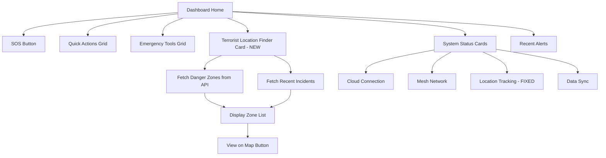
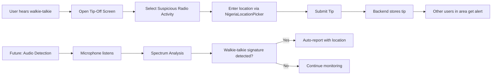

# Architecture Plan: Location Tracking, Terrorist Finder & Walkie-Talkie Detection

## Overview

Three issues reported by the user:

1. **Location Tracking shows "Inactive"** — Bug fix: `MapService.startLocationTracking()` is never called on app startup
2. **Terrorist Location Finder not showing** — New feature request: A dashboard card/widget showing known/suspected terrorist locations
3. **Walkie-talkie communication detection** — Question about technology to detect/intercept walkie-talkie communications

---

## Issue 1: Location Tracking Shows "Inactive" (Bug Fix)

### Root Cause

The dashboard at [`dashboard_screen.dart`](frontend/lib/modules/sos/screens/dashboard_screen.dart:297) reads `isTracking` from `MapService`:

```dart
_StatusCard(
  icon: Icons.my_location,
  title: 'Location Tracking',
  subtitle: isTracking ? 'Active' : 'Inactive',  // line 297
  color: isTracking ? Colors.green : Colors.grey,
),
```

`MapService.isTracking` at [`map_service.dart`](frontend/lib/modules/maps/services/map_service.dart:32) returns `_isTracking`, which is only set to `true` inside `startLocationTracking()` at line 67. However, **`startLocationTracking()` is never called anywhere in the app startup flow**.

The only place location tracking is started is inside `SOSService._startLocationTracking()` at [`sos_service.dart`](frontend/lib/modules/sos/services/sos_service.dart:193), which is only called when an SOS alert is sent.

### Fix

**File: [`frontend/lib/modules/auth/screens/permission_screen.dart`](frontend/lib/modules/auth/screens/permission_screen.dart)**

After permissions are granted (line 76-81), call `MapService.startLocationTracking()` before navigating to the dashboard.

**File: [`frontend/lib/modules/sos/screens/dashboard_screen.dart`](frontend/lib/modules/sos/screens/dashboard_screen.dart)**

In the `_DashboardHome` widget, add a `didChangeDependencies` or use a post-frame callback to call `MapService.startLocationTracking()` if not already tracking.

**OR (simpler approach):**

**File: [`frontend/lib/modules/maps/services/map_service.dart`](frontend/lib/modules/maps/services/map_service.dart)**

In the `initialize()` method (line 35), add a call to `startLocationTracking()` so tracking begins automatically when the service is initialized.

### Changes Required

| File | Change |
|------|--------|
| `frontend/lib/modules/maps/services/map_service.dart` | Add `startLocationTracking()` call inside `initialize()` method (after loading cached zones) |

---

## Issue 2: Terrorist Location Finder (New Feature)

### What the User Wants

A visible card/section on the dashboard that shows known or suspected terrorist locations, danger zones, or high-risk areas. This would help users know which areas to avoid.

### Architecture

#### Backend (already partially exists)

The backend already has:
- [`IncidentController.java`](backend/src/main/java/com/dangeremergence/controller/IncidentController.java) — `/api/v1/incidents/nearby` endpoint
- [`ZoneController.java`](backend/src/main/java/com/dangeremergence/controller/ZoneController.java) — `/api/v1/zones/danger` and `/api/v1/zones/nearby` endpoints
- [`PredictiveController.java`](backend/src/main/java/com/dangeremergence/controller/PredictiveController.java) — `/api/v1/predictive/forecast` endpoint

These can be used to fetch danger zone data.

#### Frontend

**New file: [`frontend/lib/modules/sos/widgets/terrorist_location_card.dart`](frontend/lib/modules/sos/widgets/terrorist_location_card.dart)**

A new widget that:
1. Fetches danger zones from the backend API (`/api/v1/zones/danger`)
2. Fetches recent high-severity incidents (`/api/v1/incidents/nearby`)
3. Displays them in a compact card with:
   - List of danger zones with names and distances
   - Color-coded severity indicators (red=critical, orange=high, yellow=medium)
   - "View on Map" button that navigates to the map screen

**Update: [`dashboard_screen.dart`](frontend/lib/modules/sos/screens/dashboard_screen.dart)**

Add the `TerroristLocationCard` widget in the `_DashboardHome` build method, after the "System Status" section and before "Recent Alerts".

#### Data Flow

```
Dashboard loads
  → _DashboardHome builds
  → TerroristLocationCard fetches:
     → GET /api/v1/zones/danger (danger zones from backend)
     → GET /api/v1/incidents/nearby?lat=X&lng=Y&radius=50&severity=high,critical
  → Displays results in card format
  → User taps "View on Map" → navigates to map screen with danger zones overlay
```

### Changes Required

| File | Change | Type |
|------|--------|------|
| `frontend/lib/modules/sos/widgets/terrorist_location_card.dart` | **NEW** — Widget that fetches and displays danger zones | New file |
| `frontend/lib/modules/sos/screens/dashboard_screen.dart` | Add `TerroristLocationCard` to the dashboard layout | Edit |
| `frontend/lib/shared/services/backend_api.dart` | Add `getDangerZones()` and `getNearbyIncidents()` methods if not already present | Edit |

---

## Issue 3: Walkie-Talkie Detection Technology

### The User's Question

"Terrorists use walkie-talkies to communicate. Is there any technology to communicate with/detect when a walkie-talkie is in use?"

### Technical Analysis

Walkie-talkies operate on radio frequencies (typically VHF 136-174MHz or UHF 400-512MHz). Standard smartphones **cannot directly receive or decode walkie-talkie transmissions** because:

1. Smartphone radios are designed for cellular bands (700MHz-2.6GHz), Wi-Fi (2.4/5GHz), and Bluetooth (2.4GHz)
2. Walkie-talkies use different frequency bands and modulation schemes (FM, PMR446, FRS/GMRS)
3. No smartphone has a built-in SDR (Software Defined Radio) receiver that covers these bands

### What IS Possible

#### Option A: External SDR Hardware (Recommended)
- **Hardware**: Connect an external USB SDR dongle (RTL-SDR, ~$25) via USB-OTG adapter
- **App**: Use an SDR app like SDRTouch or a custom Flutter plugin
- **Capability**: Can detect RF activity on walkie-talkie frequencies, but cannot decode encrypted communications
- **Limitation**: Requires external hardware, not practical for most users

#### Option B: Acoustic Detection (Practical for the App)
- **How it works**: Use the smartphone's microphone to detect the characteristic squelch noise, static bursts, or voice patterns from a nearby walkie-talkie
- **Implementation**: 
  - Use the existing `RecordAudio` permission (already in manifest)
  - Add audio spectrum analysis to detect walkie-talkie signatures
  - When detected, show an alert: "Walkie-talkie activity detected nearby"
- **Limitation**: Only works within earshot (~10-50 meters), cannot decode content

#### Option C: Crowd-Sourced Detection
- **How it works**: Users manually report "Walkie-talkie activity heard in this area"
- **Implementation**: Add a new tip-off type "suspicious_radio_activity" to the existing Tip-Off system
- **Benefit**: No special hardware needed, leverages the user base
- **This is the most practical approach for the current app**

### Recommended Approach: Option B + C Combined

**Phase 1 (Immediate)**: Add "Walkie-Talkie Activity" as a new tip-off type and incident type
**Phase 2 (Future)**: Add audio-based detection using the microphone

### Changes Required for Phase 1

| File | Change |
|------|--------|
| `frontend/lib/modules/sos/screens/tip_off_screen.dart` | Add 'suspicious_radio' to the tip type dropdown |
| `frontend/lib/modules/sos/screens/incident_report_screen.dart` | Add 'suspicious_radio' to the incident types list |
| `backend/.../TipOffService.java` | Add handling for 'suspicious_radio' tip type |
| `backend/.../IncidentService.java` | Add handling for 'suspicious_radio' incident type |

---

## Implementation Plan

### Step 1: Fix Location Tracking (Bug Fix)
**Files to modify:**
- [`frontend/lib/modules/maps/services/map_service.dart`](frontend/lib/modules/maps/services/map_service.dart) — Add `startLocationTracking()` call in `initialize()`

### Step 2: Create Terrorist Location Finder Card
**Files to create/modify:**
- [`frontend/lib/modules/sos/widgets/terrorist_location_card.dart`](frontend/lib/modules/sos/widgets/terrorist_location_card.dart) — NEW
- [`frontend/lib/modules/sos/screens/dashboard_screen.dart`](frontend/lib/modules/sos/screens/dashboard_screen.dart) — Add card to layout
- [`frontend/lib/shared/services/backend_api.dart`](frontend/lib/modules/sos/screens/dashboard_screen.dart) — Add API methods if needed

### Step 3: Add Walkie-Talkie Detection (Phase 1)
**Files to modify:**
- [`frontend/lib/modules/sos/screens/tip_off_screen.dart`](frontend/lib/modules/sos/screens/tip_off_screen.dart) — Add radio activity tip type
- [`frontend/lib/modules/sos/screens/incident_report_screen.dart`](frontend/lib/modules/sos/screens/incident_report_screen.dart) — Add radio activity incident type

---

## Mermaid Diagram: Dashboard Layout After Changes



## Mermaid Diagram: Walkie-Talkie Detection Flow



---

## Summary of All Changes

| # | Task | Files | Complexity |
|---|------|-------|------------|
| 1 | Fix Location Tracking | 1 file (map_service.dart) | Simple |
| 2 | Terrorist Location Finder | 2-3 files (new widget + dashboard + backend_api) | Medium |
| 3 | Walkie-Talkie Detection Phase 1 | 2 files (tip_off + incident_report) | Simple |
