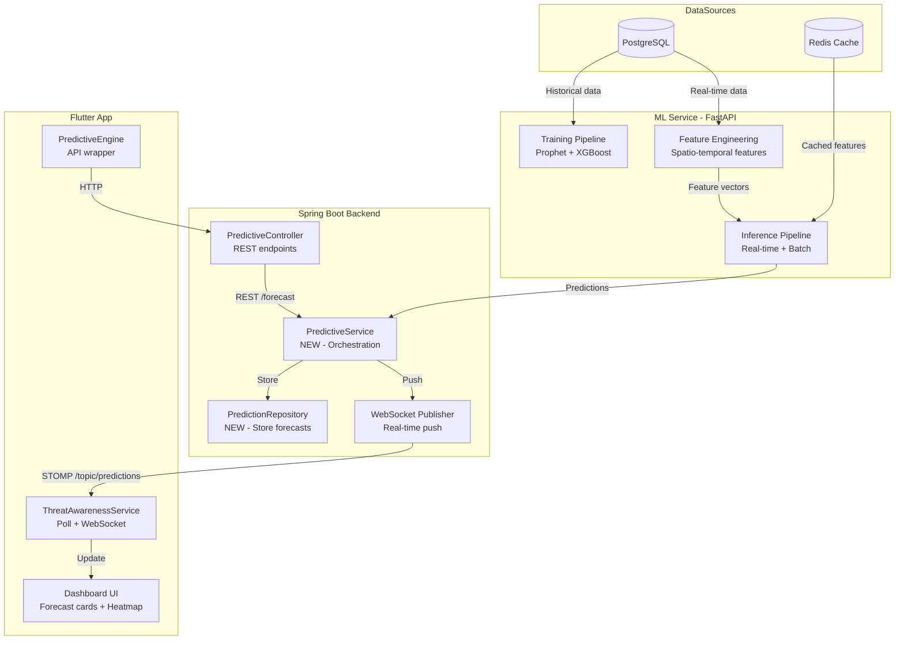
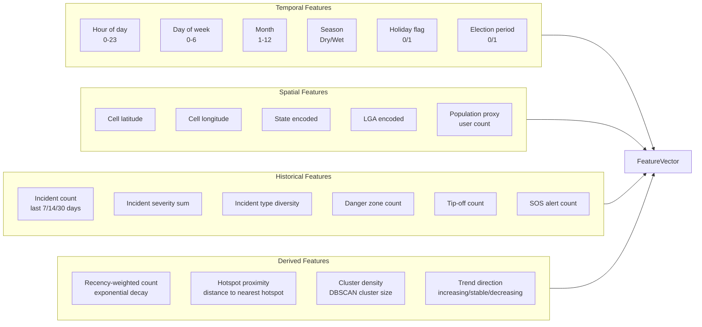
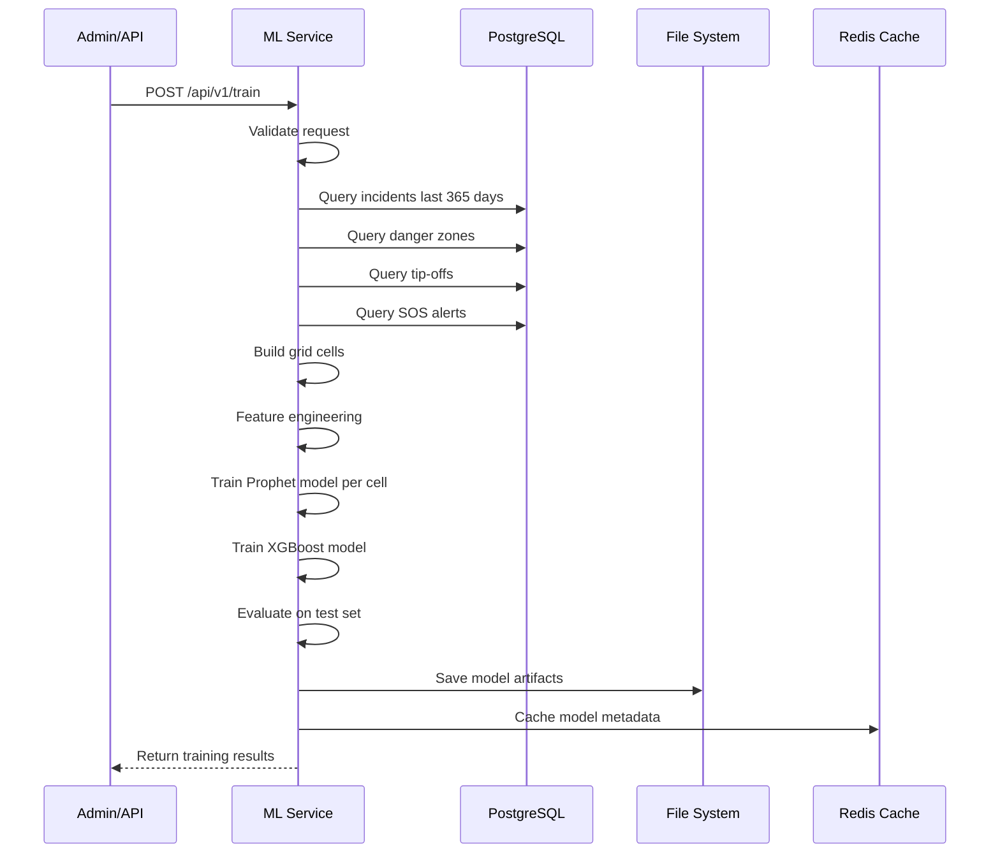
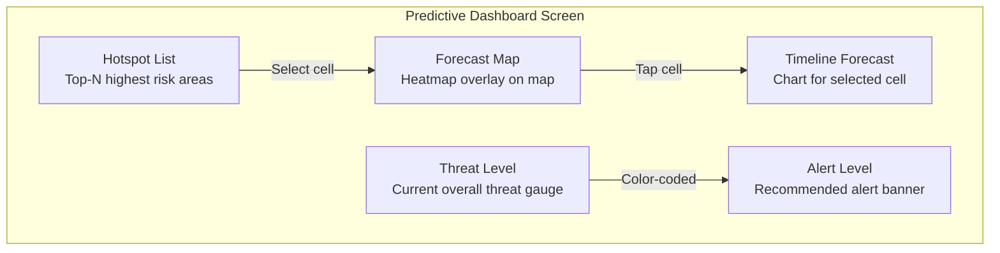

# Predictive ML Model for Terrorist Activity Forecasting

## 1. Executive Summary

This document describes the architecture for training and integrating a predictive ML model that forecasts terrorist activity, kidnappings, and security threats across Nigeria. The model ingests historical incident data, danger zones, tip-offs, SOS alerts, and temporal patterns to output risk scores, attack probabilities, and recommended alert levels for specific geographic areas and time windows.

The solution extends the existing `ml_service/` (FastAPI) and `PredictiveController.java` (Spring Boot) components with a dedicated **spatio-temporal forecasting pipeline**.

---

## 2. Current State Assessment

### 2.1 What Already Exists

| Component | Description | Limitation |
|-----------|-------------|------------|
| [`PredictiveController.java`](backend/src/main/java/com/dangeremergence/controller/PredictiveController.java:24) | `POST /forecast` — linear regression with synthetic seasonal data | Uses **synthetic data** (`Random`), not real historical data |
| [`PredictiveController.java`](backend/src/main/java/com/dangeremergence/controller/PredictiveController.java:50) | `POST /anomaly` — Z-score anomaly detection | Works on raw values, no ML |
| [`PredictiveController.java`](backend/src/main/java/com/dangeremergence/controller/PredictiveController.java:91) | `POST /optimize-resources` — greedy Hungarian assignment | No ML, simple cost function |
| [`ml_service/app/main.py`](ml_service/app/main.py:178) | `_rule_based_prioritize()` — keyword scoring | Text-only, no spatio-temporal prediction |
| [`ml_service/app/main.py`](ml_service/app/main.py:359) | `_model_prioritize()` — BART transformer model | Text classification only, not forecasting |
| [`IncidentService.java`](backend/src/main/java/com/dangeremergence/service/IncidentService.java:34) | CRUD + heatmap for incidents | No predictive analytics |
| [`ZoneService.java`](backend/src/main/java/com/dangeremergence/service/ZoneService.java:86) | Danger zone management | Reactive, not predictive |
| [`ThreatAwarenessService`](frontend/lib/modules/ai/services/threat_awareness_service.dart:80) | Frontend polling every 60s | Reactive polling, no ML forecast |
| [`PredictiveEngine`](frontend/lib/modules/predictive/services/predictive_engine.dart:9) | Frontend API wrapper for forecast/anomaly | Calls existing synthetic endpoints |

### 2.2 Data Sources Available

| Source | Table/Model | Key Fields |
|--------|-------------|------------|
| Incidents | `incidents` | `incidentType`, `latitude`, `longitude`, `severity`, `occurredAt`, `state`, `lga`, `verified` |
| Danger Zones | `zones` | `type=hazard`, `latitude`, `longitude`, `radius`, `severity`, `expiresAt`, `createdAt` |
| Tip-Offs | `tip_offs` | `tipType`, `latitude`, `longitude`, `threatScore`, `status`, `createdAt` |
| SOS Alerts | `sos_alerts` | `alertType`, `latitude`, `longitude`, `priority`, `status`, `createdAt` |
| Users | `users` | `lastSeen`, `state`, `lga` (for population density proxy) |

---

## 3. Architecture Overview



---

## 4. Model Architecture

### 4.1 Model Selection: Prophet + XGBoost Hybrid

We use a **two-stage hybrid model**:

1. **Stage 1 — Prophet (Facebook Prophet)** for time-series decomposition of incident counts per geographic cell
   - Handles seasonality (daily, weekly, yearly patterns)
   - Handles holiday effects (religious holidays, election periods)
   - Robust to missing data
   - Interpretable trend/seasonality components

2. **Stage 2 — XGBoost** for spatio-temporal risk scoring
   - Features: Prophet forecast values + geographic features + tip-off density + SOS density
   - Output: Risk score 0.0-1.0 per cell per time window
   - Handles non-linear interactions between features

### 4.2 Why Not Deep Learning (LSTM/GRU)?

| Factor | Prophet + XGBoost | LSTM/GRU |
|--------|------------------|----------|
| Training data volume | Works with limited data | Needs large datasets |
| Interpretability | High (trend/seasonality components) | Low (black box) |
| Training time | Minutes | Hours |
| Inference latency | <50ms | 100-500ms |
| Handling missing data | Built-in | Requires imputation |
| Nigeria-specific context | Easy to add holiday/event features | Requires encoding |

Given the likely limited volume of verified incident data, Prophet + XGBoost is the pragmatic choice.

### 4.3 Geographic Grid System

Nigeria is divided into a **0.1-degree grid** (~11km at the equator):

```
Grid cell size: 0.1 degrees latitude x 0.1 degrees longitude
Total cells covering Nigeria: ~900 cells
```

Each cell is identified by `cellKey = "lat,lng"` (e.g., `"9.0,7.0"` for Abuja).

---

## 5. Feature Engineering

### 5.1 Feature Groups



### 5.2 Feature Vector (Total: ~30 features)

| # | Feature | Type | Source | Description |
|---|---------|------|--------|-------------|
| 1 | `hour` | int | Temporal | Hour of prediction 0-23 |
| 2 | `day_of_week` | int | Temporal | Day of week 0-6 |
| 3 | `month` | int | Temporal | Month 1-12 |
| 4 | `is_dry_season` | bool | Temporal | Nov-Mar = dry season |
| 5 | `is_holiday` | bool | Temporal | Major religious/national holidays |
| 6 | `is_election_period` | bool | Temporal | 3 months before/after elections |
| 7 | `cell_lat` | float | Spatial | Grid cell center latitude |
| 8 | `cell_lng` | float | Spatial | Grid cell center longitude |
| 9 | `state_encoded` | int | Spatial | State label encoded |
| 10 | `lga_encoded` | int | Spatial | LGA label encoded |
| 11 | `population_proxy` | float | Spatial | Registered users in cell |
| 12 | `incident_count_7d` | int | Historical | Verified incidents last 7 days |
| 13 | `incident_count_14d` | int | Historical | Verified incidents last 14 days |
| 14 | `incident_count_30d` | int | Historical | Verified incidents last 30 days |
| 15 | `incident_severity_sum_7d` | float | Historical | Sum of severity weights last 7d |
| 16 | `incident_severity_sum_30d` | float | Historical | Sum of severity weights last 30d |
| 17 | `incident_type_diversity` | int | Historical | Unique incident types last 30d |
| 18 | `danger_zone_count` | int | Historical | Active danger zones in cell |
| 19 | `tip_off_count_7d` | int | Historical | Tip-offs last 7 days |
| 20 | `tip_off_threat_sum_7d` | float | Historical | Sum of threat scores last 7d |
| 21 | `sos_alert_count_7d` | int | Historical | SOS alerts last 7 days |
| 22 | `recency_weighted_count` | float | Derived | Exponential decay weighted incidents |
| 23 | `hotspot_distance_km` | float | Derived | Distance to nearest incident cluster |
| 24 | `cluster_density` | float | Derived | DBSCAN cluster size of nearby incidents |
| 25 | `trend_slope_7d` | float | Derived | Linear regression slope of incident rate |
| 26 | `is_weekend` | bool | Derived | Saturday or Sunday |
| 27 | `is_night` | bool | Derived | 20:00-05:59 |
| 28 | `prophet_trend` | float | Prophet | Prophet trend component |
| 29 | `prophet_seasonal` | float | Prophet | Prophet seasonal component |
| 30 | `prophet_upper_bound` | float | Prophet | Prophet uncertainty upper bound |

---

## 6. ML Service — New Endpoints

### 6.1 New Files in `ml_service/app/`

```
ml_service/
  app/
    main.py                    # Existing — add new routes
    training/
      __init__.py
      data_collector.py        # NEW: Query PostgreSQL for training data
      feature_engineer.py      # NEW: Build feature vectors
      prophet_trainer.py       # NEW: Train Prophet model
      xgboost_trainer.py       # NEW: Train XGBoost model
      pipeline.py              # NEW: Orchestrate training pipeline
    inference/
      __init__.py
      predictor.py             # NEW: Real-time prediction
      batch_predictor.py       # NEW: Batch prediction for all cells
    models/
      __init__.py
      schemas.py               # NEW: Pydantic request/response models
```

### 6.2 New API Endpoints

| Method | Path | Description |
|--------|------|-------------|
| `POST` | `/api/v1/predict/forecast` | Get forecast for specific cells + time window |
| `POST` | `/api/v1/predict/batch` | Get forecast for all active cells |
| `POST` | `/api/v1/predict/hotspots` | Get top-N highest risk cells |
| `POST` | `/api/v1/train` | Trigger training pipeline |
| `GET` | `/api/v1/train/status` | Get training status and metrics |
| `GET` | `/api/v1/models/info` | Get loaded model metadata |

### 6.3 Request/Response Schemas

**POST /api/v1/predict/forecast**
```json
// Request
{
  "cells": [
    {"lat": 9.0, "lng": 7.0},
    {"lat": 9.1, "lng": 7.0}
  ],
  "forecast_hours": 24,
  "interval_minutes": 60
}

// Response
{
  "forecasts": [
    {
      "cell_key": "9.0,7.0",
      "lat": 9.0,
      "lng": 7.0,
      "timestamps": ["2025-01-15T08:00:00Z", "2025-01-15T09:00:00Z", ...],
      "risk_scores": [0.12, 0.15, 0.22, ...],
      "attack_probability": [0.03, 0.04, 0.07, ...],
      "trend": "increasing",
      "peak_risk_time": "2025-01-15T18:00:00Z",
      "peak_risk_score": 0.45,
      "recommended_alert_level": "elevated",
      "contributing_factors": ["high_tip_off_density", "increasing_trend"]
    }
  ],
  "model_info": {
    "model_version": "2025-01-01",
    "training_date": "2025-01-10",
    "accuracy_mae": 0.08
  }
}
```

**POST /api/v1/predict/hotspots**
```json
// Request
{
  "top_n": 10,
  "forecast_hours": 48,
  "min_risk_threshold": 0.3
}

// Response
{
  "hotspots": [
    {
      "cell_key": "9.0,7.0",
      "lat": 9.0,
      "lng": 7.0,
      "state": "Federal Capital Territory",
      "lga": "Abuja Municipal",
      "peak_risk_score": 0.72,
      "peak_risk_time": "2025-01-16T14:00:00Z",
      "trend": "increasing",
      "recommended_alert_level": "high",
      "estimated_attack_count": 2.3,
      "contributing_factors": [
        {"factor": "incident_count_7d", "value": 5, "weight": 0.4},
        {"factor": "tip_off_count_7d", "value": 8, "weight": 0.3},
        {"factor": "trend_slope_7d", "value": 0.15, "weight": 0.3}
      ]
    }
  ]
}
```

---

## 7. Backend — New Java Components

### 7.1 New Files

```
backend/src/main/java/com/dangeremergence/
  service/
    PredictiveService.java       # NEW: Orchestrates ML calls + caching
    PredictionCacheService.java  # NEW: Redis caching for predictions
  controller/
    PredictiveController.java    # MODIFIED: Add new endpoints
  model/
    Prediction.java              # NEW: JPA entity for stored predictions
  repository/
    PredictionRepository.java    # NEW: JPA repository
```

### 7.2 PredictiveService.java

```java
@Service
public class PredictiveService {

    // Calls ML service for forecasts
    public Map<String, Object> getForecast(List<CellKey> cells, int forecastHours, int intervalMinutes);

    // Gets top-N hotspots from ML service
    public List<HotspotResult> getHotspots(int topN, int forecastHours, double minRisk);

    // Triggers ML training pipeline
    public void triggerTraining();

    // Gets cached predictions (fast path)
    public Map<String, Object> getCachedForecast(String cellKey);

    // Publishes predictions to WebSocket
    public void publishPredictions();
}
```

### 7.3 Modified PredictiveController.java — New Endpoints

| Method | Path | Description |
|--------|------|-------------|
| `POST` | `/api/v1/predictive/forecast` | Enhanced — delegates to ML service |
| `POST` | `/api/v1/predictive/hotspots` | NEW — get top-N hotspots |
| `POST` | `/api/v1/predictive/train` | NEW — trigger training |
| `GET` | `/api/v1/predictive/train/status` | NEW — training status |
| `GET` | `/api/v1/predictive/models/info` | NEW — model metadata |

The existing `/forecast` endpoint will be **enhanced** to:
1. Try ML service first (new endpoint)
2. Fall back to existing synthetic forecast if ML service is unavailable
3. Cache results in Redis with 5-minute TTL

### 7.4 WebSocket Integration

The `PredictiveService` will publish predictions to WebSocket topics:

| Topic | Payload | Frequency |
|-------|---------|-----------|
| `/topic/predictions/hotspots` | Top-10 hotspots | Every 15 minutes |
| `/topic/predictions/zone/{zoneId}` | Zone-specific forecast | On change + every 30 min |
| `/topic/predictions/alerts` | New high-risk predictions | Immediately |

The frontend `ThreatAwarenessService` will subscribe to these topics for real-time updates.

---

## 8. Training Pipeline

### 8.1 Training Flow



### 8.2 Training Schedule

| Trigger | Frequency | Description |
|---------|-----------|-------------|
| Manual | On demand | Admin triggers via API |
| Scheduled | Daily at 03:00 | Cron job retrains with latest data |
| Event-driven | On threshold | Auto-retrain if prediction error > 20% |

### 8.3 Model Artifacts

```
ml_service/models/
  prophet/
    prophet_model_cell_9.0_7.0.pkl   # Per-cell Prophet model
    prophet_model_cell_9.1_7.0.pkl
    ...
  xgboost/
    xgboost_model.json                # Single XGBoost model
    feature_columns.json              # Feature column order
    label_encoder_state.pkl           # State label encoder
    label_encoder_lga.pkl             # LGA label encoder
  metadata.json                       # Model version, training date, metrics
```

---

## 9. Frontend Integration

### 9.1 Modified Files

| File | Change |
|------|--------|
| [`PredictiveEngine`](frontend/lib/modules/predictive/services/predictive_engine.dart:9) | Add `getHotspots()`, `getForecast()` with new response format |
| [`ThreatAwarenessService`](frontend/lib/modules/ai/services/threat_awareness_service.dart:80) | Subscribe to `/topic/predictions/hotspots` via WebSocket |
| [`BackendApi`](frontend/lib/shared/services/backend_api.dart:234) | Add `predictForecast()`, `predictHotspots()` methods |
| New: `predictive_screen.dart` | Dashboard screen showing forecast heatmap + hotspot list |
| New: `hotspot_card.dart` | Widget for individual hotspot display |

### 9.2 WebSocket Subscription

The `ThreatAwarenessService` will subscribe to:

```dart
// In ThreatAwarenessService
void _subscribeToPredictions() {
  stompClient.subscribe('/topic/predictions/hotspots', (frame) {
    final hotspots = HotspotList.fromJson(jsonDecode(frame.body));
    _updateHotspots(hotspots);
    if (hotspots.hasNewCritical) {
      _showAlert(hotspots.criticalHotspots.first);
    }
    notifyListeners();
  });
}
```

### 9.3 Dashboard UI Components



---

## 10. Alert Level Mapping

| Risk Score Range | Alert Level | Color | Action |
|-----------------|-------------|-------|--------|
| 0.0 - 0.2 | Normal | Green | No action |
| 0.2 - 0.4 | Elevated | Yellow | Increase awareness |
| 0.4 - 0.6 | High | Orange | Notify users in area |
| 0.6 - 0.8 | Severe | Red | Push notification + vibration |
| 0.8 - 1.0 | Critical | Dark Red | Emergency alert + evacuation guidance |

---

## 11. Implementation Plan

### Phase 1: ML Service Enhancement (ml_service/)

| Step | File | Description |
|------|------|-------------|
| 1.1 | `ml_service/app/models/schemas.py` | Create Pydantic models for forecast/hotspot/train requests and responses |
| 1.2 | `ml_service/app/training/data_collector.py` | Create data collector that queries PostgreSQL for incidents, zones, tip-offs, SOS alerts |
| 1.3 | `ml_service/app/training/feature_engineer.py` | Create feature engineering module that builds the 30-feature vector per grid cell |
| 1.4 | `ml_service/app/training/prophet_trainer.py` | Create Prophet model trainer per cell |
| 1.5 | `ml_service/app/training/xgboost_trainer.py` | Create XGBoost trainer using Prophet outputs + spatial features |
| 1.6 | `ml_service/app/training/pipeline.py` | Create training pipeline orchestrator |
| 1.7 | `ml_service/app/inference/predictor.py` | Create real-time prediction module |
| 1.8 | `ml_service/app/inference/batch_predictor.py` | Create batch prediction for all cells |
| 1.9 | `ml_service/app/main.py` | Add new routes: `/api/v1/predict/forecast`, `/api/v1/predict/hotspots`, `/api/v1/train` |
| 1.10 | `ml_service/requirements.txt` | Add `prophet`, `xgboost`, `scikit-learn`, `psycopg2-binary` |

### Phase 2: Backend Enhancement (backend/)

| Step | File | Description |
|------|------|-------------|
| 2.1 | `backend/.../model/Prediction.java` | Create JPA entity for stored predictions |
| 2.2 | `backend/.../repository/PredictionRepository.java` | Create JPA repository |
| 2.3 | `backend/.../service/PredictiveService.java` | Create service that calls ML service, caches in Redis, publishes via WebSocket |
| 2.4 | `backend/.../service/PredictionCacheService.java` | Create Redis caching service for predictions |
| 2.5 | `backend/.../controller/PredictiveController.java` | Add new endpoints: hotspots, train, train/status, models/info. Enhance forecast endpoint. |
| 2.6 | `backend/pom.xml` | Add any needed dependencies |

### Phase 3: Frontend Enhancement (frontend/)

| Step | File | Description |
|------|------|-------------|
| 3.1 | `frontend/lib/shared/services/backend_api.dart` | Add `predictForecast()`, `predictHotspots()` methods |
| 3.2 | `frontend/lib/modules/predictive/services/predictive_engine.dart` | Add `getHotspots()`, enhance `forecastDangerZones()` |
| 3.3 | `frontend/lib/modules/ai/services/threat_awareness_service.dart` | Subscribe to `/topic/predictions/hotspots` via WebSocket |
| 3.4 | New: `frontend/lib/modules/predictive/screens/predictive_dashboard_screen.dart` | Create dashboard screen |
| 3.5 | New: `frontend/lib/modules/predictive/widgets/hotspot_card.dart` | Create hotspot card widget |
| 3.6 | New: `frontend/lib/modules/predictive/widgets/forecast_chart.dart` | Create forecast timeline chart |
| 3.7 | `frontend/lib/core/routes.dart` | Add route for predictive dashboard |

### Phase 4: Deployment

| Step | Description |
|------|-------------|
| 4.1 | Update `ml_service/Dockerfile` if needed for new dependencies |
| 4.2 | Update `docker-compose.yml` if ML service needs PostgreSQL access |
| 4.3 | Add database migration for `predictions` table if storing forecasts |
| 4.4 | Deploy and test end-to-end |

---

## 12. Risk Mitigation

| Risk | Mitigation |
|------|------------|
| Limited historical incident data | Prophet handles small datasets well; XGBoost can be trained with synthetic augmentation |
| Model drift over time | Daily retraining pipeline; monitoring of prediction error |
| High inference latency for all cells | Batch prediction runs every 15 min, cached in Redis; real-time requests use cache |
| False positives causing panic | Alert levels require minimum confidence threshold; human-in-loop for critical alerts |
| ML service unavailable | Backend falls back to existing synthetic forecast; frontend shows "stale data" indicator |

---

## 13. Success Metrics

| Metric | Target | Measurement |
|--------|--------|-------------|
| Prediction MAE | <0.1 | Mean absolute error of risk score vs actual incidents |
| Hotspot precision@10 | >60% | Of top-10 predicted hotspots, how many had incidents |
| Alert lead time | >2 hours | Time between prediction and actual incident |
| Inference latency | <200ms | P95 latency for single-cell forecast |
| System uptime | >99.5% | ML service availability |
