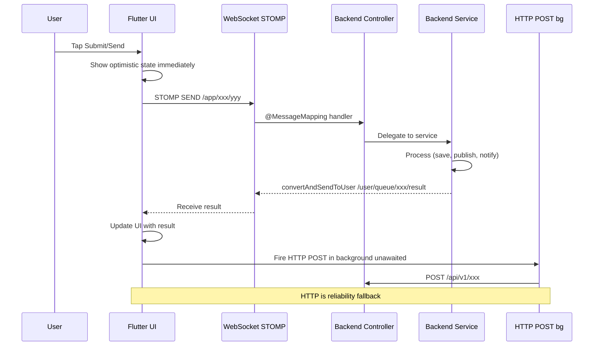

# Speed Optimization Analysis — All Application Sections

## Current Status Summary

| # | Section | Current Transport | STOMP SEND? | Optimistic UI? | HTTP Background? | Priority |
|---|---------|-------------------|-------------|----------------|-----------------|----------|
| 1 | **Message** (inbox_screen) | STOMP SEND + HTTP bg | ✅ Done | ✅ Done | ✅ Done | ✅ COMPLETE |
| 2 | **SOS Alert** (sos_service) | STOMP SEND + HTTP bg | ✅ Done | ✅ Done | ✅ Done | ✅ COMPLETE |
| 3 | **Broadcast** (create_broadcast) | STOMP SEND + HTTP bg | ✅ Done | ✅ Done | ✅ Done | ✅ COMPLETE |
| 4 | **Safe Route** (safe_route_screen) | HTTP POST only | ❌ | ❌ | ❌ | 🔴 HIGH |
| 5 | **Tip Off** (tip_off_screen) | HTTP POST only | ❌ | ❌ | ❌ | 🔴 HIGH |
| 6 | **Radio Broadcast** (radio_broadcast) | HTTP POST only | ❌ | ❌ | ❌ | 🔴 HIGH |
| 7 | **Walkie Talkie** (walkie_talkie_monitor) | HTTP POST only | ❌ | ❌ | ❌ | 🟡 MEDIUM |
| 8 | **Zone Details** (zone_details_screen) | Pure UI — no API calls | N/A | N/A | N/A | ✅ NO ACTION |
| 9 | **Terrorist Location Card** (terrorist_location_card) | HTTP GET only | N/A (read) | ❌ | N/A | 🟡 MEDIUM |
| 10 | **Threat Level** (threat_awareness_service) | HTTP GET polling + offline | N/A (read) | ✅ Done | N/A | ✅ COMPLETE |

---

## Detailed Analysis

### 1. ✅ Message — Already Optimized
**File:** [`inbox_screen.dart`](frontend/lib/modules/sos/screens/inbox_screen.dart:258)
- **Pattern:** STOMP SEND → `/app/messages/send` → UI updates to 'sent' immediately → HTTP POST in background via `unawaited()`
- **Backend:** [`StompMessageController.java`](backend/src/main/java/com/dangeremergence/controller/StompMessageController.java:36) handles `/app/messages/send`
- **Status:** ✅ Fully optimized

### 2. ✅ SOS Alert — Already Optimized
**File:** [`sos_service.dart`](frontend/lib/modules/sos/services/sos_service.dart:221)
- **Pattern:** STOMP SEND → `/app/alerts/send` → save locally → mesh/LoRa/SMS → HTTP POST in background
- **Backend:** [`StompAlertController.java`](backend/src/main/java/com/dangeremergence/controller/StompAlertController.java:35) handles `/app/alerts/send`
- **Status:** ✅ Fully optimized

### 3. ✅ Broadcast — Already Optimized
**File:** [`create_broadcast_screen.dart`](frontend/lib/modules/sos/screens/create_broadcast_screen.dart:107)
- **Pattern:** STOMP SEND → `/app/broadcasts/create` → show success immediately → HTTP POST in background
- **Backend:** [`StompBroadcastController.java`](backend/src/main/java/com/dangeremergence/controller/StompBroadcastController.java:35) handles `/app/broadcasts/create`
- **Status:** ✅ Fully optimized

### 4. 🔴 Safe Route — Needs STOMP SEND
**File:** [`safe_route_screen.dart`](frontend/lib/modules/sos/screens/safe_route_screen.dart:77)
- **Current:** `_planRoute()` awaits `_api.planSafeRoute()` HTTP POST — user sees spinner until HTTP round-trip completes
- **Problem:** Route planning is slow because it waits for the full HTTP response before showing results
- **Backend:** [`RouteController.java`](backend/src/main/java/com/dangeremergence/controller/RouteController.java:24) — `POST /api/v1/route/plan`
- **Backend Service:** [`RouteService.java`](backend/src/main/java/com/dangeremergence/service/RouteService.java:34) — `planSafeRoute()` with danger score calculation
- **Fix Required:**
  1. Create [`StompRouteController.java`](backend/src/main/java/com/dangeremergence/controller/) — `@MessageMapping("/route/plan")` that delegates to `RouteService.planSafeRoute()` and sends result back via `SimpMessagingTemplate.convertAndSendToUser()`
  2. Modify `safe_route_screen.dart` to send STOMP SEND to `/app/route/plan`, show "Planning..." immediately, and listen for response on user queue `/user/queue/route/result`
  3. Fire HTTP POST in background as fallback

### 5. 🔴 Tip Off — Needs STOMP SEND
**File:** [`tip_off_screen.dart`](frontend/lib/modules/sos/screens/tip_off_screen.dart:91)
- **Current:** `_submit()` awaits `BackendApi().submitTip()` HTTP POST — user sees spinner until HTTP round-trip completes
- **Problem:** Tip submission is slow because it waits for HTTP response before showing success
- **Backend:** [`TipOffController.java`](backend/src/main/java/com/dangeremergence/controller/TipOffController.java:29) — `POST /api/v1/tips`
- **Backend Service:** [`TipOffService.java`](backend/src/main/java/com/dangeremergence/service/TipOffService.java:37) — `submitTip()` with AI threat scoring
- **Fix Required:**
  1. Create [`StompTipOffController.java`](backend/src/main/java/com/dangeremergence/controller/) — `@MessageMapping("/tip-offs/submit")` that delegates to `TipOffService.submitTip()`
  2. Modify `tip_off_screen.dart` to send STOMP SEND to `/app/tip-offs/submit`, show "Submitted" immediately, and fire HTTP POST in background
  3. Add WebSocket connection management in tip_off_screen.dart (similar to create_broadcast_screen.dart)

### 6. 🔴 Radio Broadcast — Needs STOMP SEND
**File:** [`radio_broadcast_screen.dart`](frontend/lib/modules/sos/screens/radio_broadcast_screen.dart:83)
- **Current:** `_submit()` awaits `_api.createRadioBroadcast()` HTTP POST — user sees spinner until HTTP round-trip completes
- **Problem:** Radio broadcast submission is slow because it waits for HTTP response
- **Backend:** [`RadioController.java`](backend/src/main/java/com/dangeremergence/controller/RadioController.java:28) — `POST /api/v1/radio/broadcast`
- **Backend Service:** [`RadioBroadcastService.java`](backend/src/main/java/com/dangeremergence/service/RadioBroadcastService.java:35) — `createBroadcast()` with TTS audio generation
- **Fix Required:**
  1. Create [`StompRadioController.java`](backend/src/main/java/com/dangeremergence/controller/) — `@MessageMapping("/radio/broadcast")` that delegates to `RadioBroadcastService.createBroadcast()`
  2. Modify `radio_broadcast_screen.dart` to send STOMP SEND to `/app/radio/broadcast`, show "Broadcast sent!" immediately, and fire HTTP POST in background
  3. Add WebSocket connection management in radio_broadcast_screen.dart

### 7. 🟡 Walkie Talkie Monitor — Needs STOMP SEND (Lower Priority)
**File:** [`walkie_talkie_monitor_screen.dart`](frontend/lib/modules/sos/screens/walkie_talkie_monitor_screen.dart:141)
- **Current:** `_captureAndAnalyze()` records 5s audio, then awaits `_detector.analyzeAudio()` HTTP POST
- **Problem:** Audio analysis is inherently slow (5s recording + HTTP round-trip). STOMP SEND can help with the HTTP part but the recording time dominates.
- **Backend:** [`AIController.java`](backend/src/main/java/com/dangeremergence/controller/AIController.java:166) — `POST /api/v1/analyze-audio`
- **Fix Required:**
  1. Create [`StompAudioController.java`](backend/src/main/java/com/dangeremergence/controller/) — `@MessageMapping("/analyze/audio")` that delegates to `AIController` audio analysis logic
  2. Modify `walkie_talkie_monitor_screen.dart` to send STOMP SEND to `/app/analyze/audio` and listen for response on user queue
  3. Fire HTTP POST in background as fallback

### 8. ✅ Zone Details — No Action Needed
**File:** [`zone_details_screen.dart`](frontend/lib/modules/sos/screens/zone_details_screen.dart:1)
- **Current:** Pure `StatelessWidget` — receives zone data via route arguments. No API calls.
- **Status:** ✅ No optimization needed

### 9. 🟡 Terrorist Location Card — Needs Real-Time Updates
**File:** [`terrorist_location_card.dart`](frontend/lib/modules/sos/widgets/terrorist_location_card.dart:30)
- **Current:** `_loadDangerZones()` calls `BackendApi().getDangerZones()` via HTTP GET. Has offline fallback to SQLite.
- **Problem:** Data is loaded once on initState and only refreshed manually via refresh button. No real-time updates.
- **Fix Required:**
  1. Add WebSocket subscription to `/topic/zones/danger` for real-time zone updates
  2. When a new danger zone is published via WebSocket, update the list immediately without HTTP polling
  3. Keep HTTP GET as initial load and offline fallback

### 10. ✅ Threat Level — Already Optimized
**File:** [`threat_awareness_service.dart`](frontend/lib/modules/ai/services/threat_awareness_service.dart:227)
- **Current:** Polls every 60s via HTTP. Has full offline fallback with SQLite cache and local keyword analysis. Sends local notifications on critical alerts.
- **Status:** ✅ Fully optimized

---

## Implementation Plan

### Phase 1: Backend STOMP Controllers (4 new files)

1. **`StompRouteController.java`** — `@MessageMapping("/route/plan")`
   - Delegates to `RouteService.planSafeRoute()`
   - Sends result back via `SimpMessagingTemplate.convertAndSendToUser()`

2. **`StompTipOffController.java`** — `@MessageMapping("/tip-offs/submit")`
   - Delegates to `TipOffService.submitTip()`
   - Returns success acknowledgment

3. **`StompRadioController.java`** — `@MessageMapping("/radio/broadcast")`
   - Delegates to `RadioBroadcastService.createBroadcast()`
   - Returns success acknowledgment

4. **`StompAudioController.java`** — `@MessageMapping("/analyze/audio")`
   - Delegates to audio analysis logic (same as `AIController.analyzeAudio()`)
   - Sends analysis result back via user queue

### Phase 2: Frontend STOMP SEND Integration (4 files modified)

1. **`safe_route_screen.dart`**
   - Add WebSocket connection (similar to create_broadcast_screen.dart)
   - Add `_sendRouteViaStomp()` method
   - Modify `_planRoute()` to: STOMP SEND → show "Planning..." → listen for result on `/user/queue/route/result` → HTTP POST in background

2. **`tip_off_screen.dart`**
   - Add WebSocket connection
   - Add `_sendTipViaStomp()` method
   - Modify `_submit()` to: STOMP SEND → show "Submitted" immediately → HTTP POST in background

3. **`radio_broadcast_screen.dart`**
   - Add WebSocket connection
   - Add `_sendRadioViaStomp()` method
   - Modify `_submit()` to: STOMP SEND → show "Broadcast sent!" immediately → HTTP POST in background

4. **`walkie_talkie_monitor_screen.dart`**
   - Add WebSocket connection
   - Add `_sendAudioViaStomp()` method
   - Modify `_captureAndAnalyze()` to: STOMP SEND → show analyzing → listen for result on `/user/queue/analyze/audio/result` → HTTP POST in background

### Phase 3: Real-Time Updates (1 file modified)

5. **`terrorist_location_card.dart`**
   - Add WebSocket subscription to `/topic/zones/danger`
   - Add `_zoneUpdateSubscription` to listen for real-time zone updates
   - When new zone data arrives, merge into `_dangerZones` list and update UI

---

## Architecture Diagram

```mermaid
flowchart TB
    subgraph Frontend
        MSG[Message Screen]
        SOS[SOS Service]
        BC[Broadcast Screen]
        SR[Safe Route Screen]
        TO[Tip Off Screen]
        RB[Radio Broadcast Screen]
        WT[Walkie Talkie Monitor]
        TC[Terrorist Location Card]
        TA[Threat Awareness Service]
    end

    subgraph WebSocket[WebSocket STOMP Fast Path]
        direction LR
        W1[/app/messages/send]
        W2[/app/alerts/send]
        W3[/app/broadcasts/create]
        W4[/app/route/plan]
        W5[/app/tip-offs/submit]
        W6[/app/radio/broadcast]
        W7[/app/analyze/audio]
        W8[/topic/zones/danger]
    end

    subgraph HTTP[HTTP Fallback Path]
        H1[POST /api/v1/messages]
        H2[POST /api/v1/alerts]
        H3[POST /api/v1/broadcasts]
        H4[POST /api/v1/route/plan]
        H5[POST /api/v1/tips]
        H6[POST /api/v1/radio/broadcast]
        H7[POST /api/v1/analyze-audio]
        H8[GET /api/v1/zones/danger]
    end

    MSG --> W1
    MSG -.-> H1
    SOS --> W2
    SOS -.-> H2
    BC --> W3
    BC -.-> H3
    SR --> W4
    SR -.-> H4
    TO --> W5
    TO -.-> H5
    RB --> W6
    RB -.-> H6
    WT --> W7
    WT -.-> H7
    TC --> W8
    TC -.-> H8
    TA -.-> H8

    style W1,W2,W3,W4,W5,W6,W7,W8 fill:#4CAF50,color:#fff
    style H1,H2,H3,H4,H5,H6,H7,H8 fill:#FF9800,color:#fff
```

---

## Data Flow: STOMP SEND Pattern



---

## Files to Create

| File | Purpose |
|------|---------|
| `backend/src/main/java/com/dangeremergence/controller/StompRouteController.java` | STOMP handler for `/app/route/plan` |
| `backend/src/main/java/com/dangeremergence/controller/StompTipOffController.java` | STOMP handler for `/app/tip-offs/submit` |
| `backend/src/main/java/com/dangeremergence/controller/StompRadioController.java` | STOMP handler for `/app/radio/broadcast` |
| `backend/src/main/java/com/dangeremergence/controller/StompAudioController.java` | STOMP handler for `/app/analyze/audio` |

## Files to Modify

| File | Changes |
|------|---------|
| `frontend/lib/modules/sos/screens/safe_route_screen.dart` | Add WebSocket + STOMP SEND for route planning |
| `frontend/lib/modules/sos/screens/tip_off_screen.dart` | Add WebSocket + STOMP SEND for tip submission |
| `frontend/lib/modules/sos/screens/radio_broadcast_screen.dart` | Add WebSocket + STOMP SEND for radio broadcasts |
| `frontend/lib/modules/sos/screens/walkie_talkie_monitor_screen.dart` | Add WebSocket + STOMP SEND for audio analysis |
| `frontend/lib/modules/sos/widgets/terrorist_location_card.dart` | Add WebSocket subscription for real-time zone updates |
