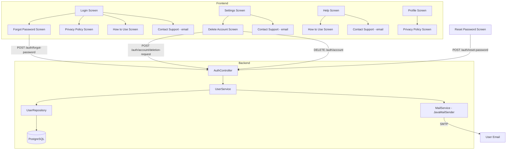
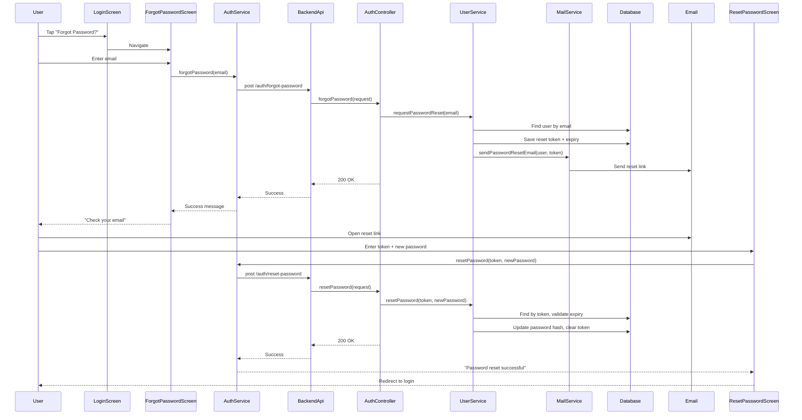
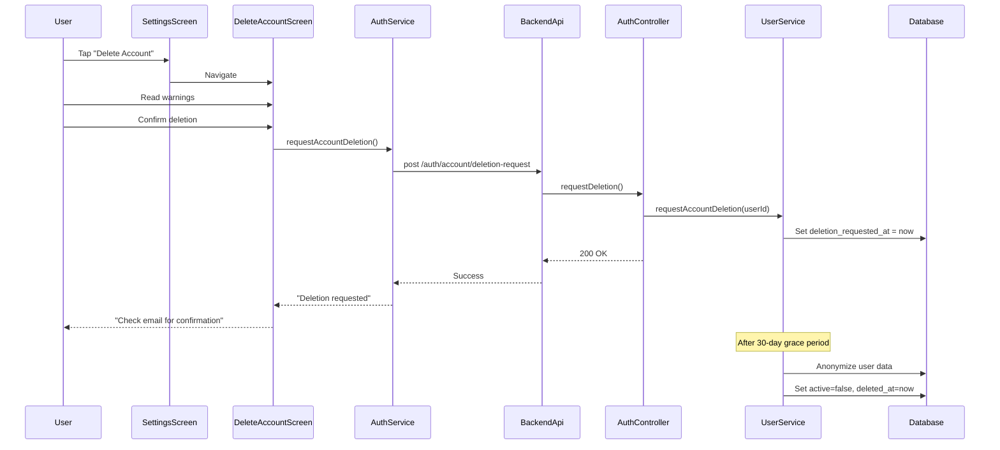

# Store Compliance & User Experience Features — Architecture Design

## Overview

This document outlines the architecture for implementing 5 features required for Google Play Store and Apple App Store compliance, plus user experience improvements:

1. **Password Reset (Forgot Password)** — Email-based password reset flow
2. **Account Deletion** — User-initiated account deletion with data cleanup
3. **Privacy Policy** — In-app privacy policy page
4. **Contact/Support** — Display `intelligence@resultscaleai.com` in the app
5. **How-to-Use Guide** — In-app usage guide / onboarding

---

## 1. Password Reset (Forgot Password)

### Backend Changes

#### 1a. Add `spring-boot-starter-mail` dependency to `pom.xml`

```xml
<dependency>
    <groupId>org.springframework.boot</groupId>
    <artifactId>spring-boot-starter-mail</artifactId>
</dependency>
```

#### 1b. Add SMTP configuration to `application.yml`

```yaml
spring:
  mail:
    host: ${MAIL_HOST:smtp.gmail.com}
    port: ${MAIL_PORT:587}
    username: ${MAIL_USERNAME}
    password: ${MAIL_PASSWORD}
    properties:
      mail:
        smtp:
          auth: true
          starttls:
            enable: true
        transport:
          protocol: smtp
```

#### 1c. Add new fields to `User.java` model

| Field | Type | Purpose |
|-------|------|---------|
| `passwordResetToken` | String | UUID token for password reset |
| `passwordResetTokenExpiry` | LocalDateTime | Expiry timestamp (1 hour from request) |

#### 1d. Add Flyway migration `V8__add_password_reset_fields.sql`

```sql
ALTER TABLE users
    ADD COLUMN password_reset_token VARCHAR(36) NULL,
    ADD COLUMN password_reset_token_expiry TIMESTAMP NULL;
```

#### 1e. Add new methods to `UserRepository.java`

```java
Optional<User> findByPasswordResetToken(String passwordResetToken);
```

#### 1f. Add new methods to `UserService.java`

- `requestPasswordReset(String email)` — Generate UUID token, set 1-hour expiry, send email
- `resetPassword(String token, String newPassword)` — Validate token, update password, clear token
- `sendPasswordResetEmail(User user, String token)` — Send email via `JavaMailSender`

#### 1g. Add new endpoints to `AuthController.java`

| Method | Endpoint | Auth | Description |
|--------|----------|------|-------------|
| POST | `/api/v1/auth/forgot-password` | Public | Accept email, send reset link |
| POST | `/api/v1/auth/reset-password` | Public | Accept token + new password |

Request/Response DTOs:

```java
public static class ForgotPasswordRequest {
    private String email;
}

public static class ResetPasswordRequest {
    private String token;
    private String newPassword;
}
```

#### 1h. Update `SecurityConfig.java`

No changes needed — `/api/v1/auth/**` is already `permitAll()`.

### Frontend Changes

#### 1i. Add API methods to `BackendApi` (`backend_api.dart`)

```dart
Future<Map<String, dynamic>> forgotPassword(String email) async {
  return post('/auth/forgot-password', body: {'email': email});
}

Future<Map<String, dynamic>> resetPassword(String token, String newPassword) async {
  return post('/auth/reset-password', body: {
    'token': token,
    'newPassword': newPassword,
  });
}
```

#### 1j. Add methods to `AuthService` (`auth_service.dart`)

```dart
Future<AuthResult> forgotPassword(String email) async { ... }
Future<AuthResult> resetPassword(String token, String newPassword) async { ... }
```

#### 1k. Add new routes to `routes.dart`

```dart
static const String forgotPassword = '/forgot-password';
static const String resetPassword = '/reset-password';
```

#### 1l. Create new screens

- **`forgot_password_screen.dart`** — Email input form, sends reset request
- **`reset_password_screen.dart`** — Token + new password form (accessed via email link)

#### 1m. Update `login_screen.dart`

Add "Forgot Password?" link below the password field (line ~266):

```dart
// Forgot Password link (login mode only)
if (_isLogin) ...[
  Align(
    alignment: Alignment.centerRight,
    child: TextButton(
      onPressed: () => Navigator.pushNamed(context, AppRoutes.forgotPassword),
      child: const Text('Forgot Password?'),
    ),
  ),
  const SizedBox(height: 8),
],
```

---

## 2. Account Deletion

### Backend Changes

#### 2a. Add new fields to `User.java` model

| Field | Type | Purpose |
|-------|------|---------|
| `deletedAt` | LocalDateTime | When deletion was requested |
| `deletionRequestedAt` | LocalDateTime | When deletion was requested (for grace period) |

#### 2b. Add Flyway migration `V9__add_account_deletion_fields.sql`

```sql
ALTER TABLE users
    ADD COLUMN deleted_at TIMESTAMP NULL,
    ADD COLUMN deletion_requested_at TIMESTAMP NULL;
```

#### 2c. Add new methods to `UserService.java`

- `requestAccountDeletion(String userId)` — Set `deletionRequestedAt`, schedule actual deletion after 30-day grace period
- `cancelAccountDeletion(String userId)` — Clear `deletionRequestedAt`
- `deleteUserAccount(String userId)` — Anonymize user data (null out PII, set `active=false`, set `deletedAt`)
- `processPendingDeletions()` — Scheduled task to process expired deletion requests

#### 2d. Add new endpoints to `AuthController.java`

| Method | Endpoint | Auth | Description |
|--------|----------|------|-------------|
| POST | `/api/v1/auth/account/deletion-request` | Authenticated | Request account deletion |
| POST | `/api/v1/auth/account/cancel-deletion` | Authenticated | Cancel deletion request |
| DELETE | `/api/v1/auth/account` | Authenticated | Actually delete account (after grace period) |

#### 2e. Update `SecurityConfig.java`

No changes needed — authenticated endpoints are covered by `.anyRequest().authenticated()`.

### Frontend Changes

#### 2f. Add API methods to `BackendApi` (`backend_api.dart`)

```dart
Future<Map<String, dynamic>> requestAccountDeletion() async {
  return post('/auth/account/deletion-request');
}

Future<Map<String, dynamic>> cancelAccountDeletion() async {
  return post('/auth/account/cancel-deletion');
}

Future<void> deleteAccount() async {
  await delete('/auth/account');
}
```

#### 2g. Add methods to `AuthService` (`auth_service.dart`)

```dart
Future<AuthResult> requestAccountDeletion() async { ... }
Future<AuthResult> cancelAccountDeletion() async { ... }
Future<void> deleteAccount() async { ... }
```

#### 2h. Add new route to `routes.dart`

```dart
static const String deleteAccount = '/delete-account';
```

#### 2i. Create new screen

- **`delete_account_screen.dart`** — Confirmation flow with warnings about data loss, re-authentication requirement

#### 2j. Update `settings_screen.dart`

Add "Account" section with "Delete Account" option (before the App Info section at line ~206):

```dart
// Account section
Card(
  child: Column(
    crossAxisAlignment: CrossAxisAlignment.start,
    children: [
      const Padding(
        padding: EdgeInsets.fromLTRB(16, 16, 16, 8),
        child: Text(
          'Account',
          style: TextStyle(fontSize: 16, fontWeight: FontWeight.bold),
        ),
      ),
      ListTile(
        leading: const Icon(Icons.delete_forever_outlined, color: Colors.red),
        title: const Text('Delete Account'),
        subtitle: const Text('Permanently delete your account and data'),
        onTap: () => Navigator.pushNamed(context, AppRoutes.deleteAccount),
      ),
    ],
  ),
),
```

---

## 3. Privacy Policy

### Frontend Changes (No backend needed — static content)

#### 3a. Add new route to `routes.dart`

```dart
static const String privacyPolicy = '/privacy-policy';
```

#### 3b. Create new screen

- **`privacy_policy_screen.dart`** — Scrollable privacy policy page with the following sections:
  - Information We Collect
  - How We Use Your Information
  - Data Sharing and Disclosure
  - Data Retention
  - Your Rights
  - Contact Information
  - Changes to This Policy

#### 3c. Add privacy policy link to `login_screen.dart`

Add at the bottom of the login screen (after the emergency access section, before closing Column):

```dart
const SizedBox(height: 24),
TextButton(
  onPressed: () => Navigator.pushNamed(context, AppRoutes.privacyPolicy),
  child: Text(
    'Privacy Policy',
    style: TextStyle(color: Colors.grey[500], fontSize: 12),
  ),
),
```

#### 3d. Update `profile_screen.dart` — `_showAboutDialog` method

Replace the placeholder `debugPrint` at line 90 with actual navigation:

```dart
TextButton(
  onPressed: () {
    Navigator.pop(context); // close dialog
    Navigator.pushNamed(context, AppRoutes.privacyPolicy);
  },
  child: const Text('Read Privacy Policy'),
),
```

---

## 4. Contact/Support

### Frontend Changes (No backend needed — static info)

#### 4a. Add support email constant to `constants.dart`

```dart
static const String supportEmail = 'intelligence@resultscaleai.com';
```

#### 4b. Update `login_screen.dart`

Add contact support link at the very bottom of the screen (after privacy policy):

```dart
const SizedBox(height: 4),
TextButton(
  onPressed: () {
    // Copy email to clipboard or open email client
    // For now, show snackbar with email address
    ScaffoldMessenger.of(context).showSnackBar(
      SnackBar(content: Text('Support: intelligence@resultscaleai.com')),
    );
  },
  child: Text(
    'Contact Support: intelligence@resultscaleai.com',
    style: TextStyle(color: Colors.grey[500], fontSize: 11),
  ),
),
```

#### 4c. Update `help_screen.dart`

Replace the placeholder "Contact Support" button (line ~118-129) with actual email display:

```dart
SizedBox(
  width: double.infinity,
  child: ElevatedButton.icon(
    onPressed: () {
      ScaffoldMessenger.of(context).showSnackBar(
        const SnackBar(
          content: Text('Email: intelligence@resultscaleai.com\nWe will respond within 24 hours.'),
          duration: Duration(seconds: 5),
        ),
      );
    },
    icon: const Icon(Icons.support_agent),
    label: const Text('Contact Support: intelligence@resultscaleai.com'),
    style: ElevatedButton.styleFrom(
      padding: const EdgeInsets.symmetric(vertical: 16),
    ),
  ),
),
```

#### 4d. Update `settings_screen.dart`

Add "Support" section with contact email:

```dart
// Support section
Card(
  child: Column(
    crossAxisAlignment: CrossAxisAlignment.start,
    children: [
      const Padding(
        padding: EdgeInsets.fromLTRB(16, 16, 16, 8),
        child: Text(
          'Support',
          style: TextStyle(fontSize: 16, fontWeight: FontWeight.bold),
        ),
      ),
      ListTile(
        leading: const Icon(Icons.email_outlined, color: AppTheme.primaryColor),
        title: const Text('Email Support'),
        subtitle: const Text('intelligence@resultscaleai.com'),
        onTap: () {
          ScaffoldMessenger.of(context).showSnackBar(
            const SnackBar(content: Text('Support: intelligence@resultscaleai.com')),
          );
        },
      ),
    ],
  ),
),
```

---

## 5. How-to-Use Guide

### Frontend Changes (No backend needed — static content)

#### 5a. Add new route to `routes.dart`

```dart
static const String howToUse = '/how-to-use';
```

#### 5b. Create new screen

- **`how_to_use_screen.dart`** — A comprehensive usage guide with sections:
  - Getting Started (registration, login, emergency access)
  - Sending SOS Alerts
  - Using the Map (danger zones, safe zones)
  - Broadcasting (Mass Alert System)
  - Safe Route Planning
  - Submitting Tip-offs
  - Radio Broadcasts
  - Mesh Network Communication
  - Offline Mode
  - Profile & Settings

#### 5c. Add "How to Use" link to `login_screen.dart`

Add before the privacy policy link:

```dart
TextButton(
  onPressed: () => Navigator.pushNamed(context, AppRoutes.howToUse),
  child: Text(
    'How to Use This App',
    style: TextStyle(color: Colors.grey[500], fontSize: 12),
  ),
),
```

#### 5d. Update `help_screen.dart`

Add a "View Full Guide" button at the top or bottom of the help screen:

```dart
// At the top, after emergency numbers
SizedBox(
  width: double.infinity,
  child: OutlinedButton.icon(
    onPressed: () => Navigator.pushNamed(context, AppRoutes.howToUse),
    icon: const Icon(Icons.menu_book_outlined),
    label: const Text('View Full Usage Guide'),
    style: OutlinedButton.styleFrom(
      padding: const EdgeInsets.symmetric(vertical: 16),
    ),
  ),
),
```

---

## File Change Summary

### Backend Files to Modify

| File | Change |
|------|--------|
| `backend/pom.xml` | Add `spring-boot-starter-mail` dependency |
| `backend/src/main/resources/application.yml` | Add `spring.mail` SMTP configuration |
| `backend/src/main/java/com/dangeremergence/model/User.java` | Add `passwordResetToken`, `passwordResetTokenExpiry`, `deletedAt`, `deletionRequestedAt` fields |
| `backend/src/main/java/com/dangeremergence/repository/UserRepository.java` | Add `findByPasswordResetToken` query |
| `backend/src/main/java/com/dangeremergence/service/UserService.java` | Add `requestPasswordReset`, `resetPassword`, `sendPasswordResetEmail`, `requestAccountDeletion`, `cancelAccountDeletion`, `deleteUserAccount`, `processPendingDeletions` methods |
| `backend/src/main/java/com/dangeremergence/controller/AuthController.java` | Add `forgotPassword`, `resetPassword`, `requestDeletion`, `cancelDeletion`, `deleteAccount` endpoints + DTOs |
| `backend/src/main/resources/db/migration/V8__add_password_reset_fields.sql` | New migration for password reset fields |
| `backend/src/main/resources/db/migration/V9__add_account_deletion_fields.sql` | New migration for account deletion fields |

### Frontend Files to Modify

| File | Change |
|------|--------|
| `frontend/lib/core/constants.dart` | Add `supportEmail` constant |
| `frontend/lib/core/routes.dart` | Add `forgotPassword`, `resetPassword`, `deleteAccount`, `privacyPolicy`, `howToUse` routes |
| `frontend/lib/shared/services/backend_api.dart` | Add `forgotPassword`, `resetPassword`, `requestAccountDeletion`, `cancelAccountDeletion`, `deleteAccount` methods |
| `frontend/lib/modules/auth/services/auth_service.dart` | Add `forgotPassword`, `resetPassword`, `requestAccountDeletion`, `cancelAccountDeletion`, `deleteAccount` methods |
| `frontend/lib/modules/auth/screens/login_screen.dart` | Add "Forgot Password?", "Privacy Policy", "How to Use", "Contact Support" links |
| `frontend/lib/modules/sos/screens/settings_screen.dart` | Add "Account" section with Delete Account, "Support" section with email |
| `frontend/lib/modules/sos/screens/profile_screen.dart` | Update About dialog to navigate to privacy policy |
| `frontend/lib/modules/sos/screens/help_screen.dart` | Add "View Full Guide" button, update contact support with email |

### Frontend Files to Create

| File | Purpose |
|------|---------|
| `frontend/lib/modules/auth/screens/forgot_password_screen.dart` | Email input for password reset |
| `frontend/lib/modules/auth/screens/reset_password_screen.dart` | Token + new password form |
| `frontend/lib/modules/auth/screens/delete_account_screen.dart` | Account deletion confirmation flow |
| `frontend/lib/modules/auth/screens/privacy_policy_screen.dart` | Static privacy policy page |
| `frontend/lib/modules/auth/screens/how_to_use_screen.dart` | Comprehensive usage guide |

---

## Architecture Diagram



---

## Data Flow: Password Reset



---

## Data Flow: Account Deletion



---

## Store Compliance Checklist

### Google Play Store Requirements
- [x] **Account Deletion**: Implemented — user can request deletion, 30-day grace period, data anonymized
- [x] **Privacy Policy**: Implemented — in-app privacy policy screen
- [x] **Contact Information**: Implemented — support email displayed in app
- [x] **Password Reset**: Implemented — email-based password reset flow
- [ ] **Data Safety Section**: Requires manual entry in Google Play Console (describe data collected: email, phone, location, medical info)
- [ ] **Content Rating**: Requires manual questionnaire in Google Play Console

### Apple App Store Requirements
- [x] **Account Deletion**: Same as Google Play
- [x] **Privacy Policy**: Same as Google Play
- [x] **Contact Information**: Same as Google Play
- [x] **Password Reset**: Same as Google Play
- [ ] **Sign in with Apple**: May be required if using social logins (not applicable — email/password only)
- [ ] **Data Collection Disclosure**: Requires manual entry in App Store Connect

---

## Implementation Order

1. **Backend: Password Reset** (pom.xml, application.yml, User.java, V8 migration, UserRepository, UserService, AuthController)
2. **Frontend: Password Reset** (BackendApi, AuthService, forgot_password_screen, reset_password_screen, routes, login_screen)
3. **Backend: Account Deletion** (User.java, V9 migration, UserService, AuthController)
4. **Frontend: Account Deletion** (BackendApi, AuthService, delete_account_screen, routes, settings_screen)
5. **Frontend: Privacy Policy** (privacy_policy_screen, routes, login_screen, profile_screen)
6. **Frontend: Contact/Support** (constants, login_screen, help_screen, settings_screen)
7. **Frontend: How-to-Use Guide** (how_to_use_screen, routes, login_screen, help_screen)
8. **Git commit and push**
